# Koo Fruit Engine — User Manual

> **Version 1.5.0** — Photo → 3D realistic banana with curl animation.
> A Blender 4.2+ extension by kaiser390.

### What's new in 1.5.0

* **Live colour editing** — every colour swatch (Outer / Inner / Tip /
  Membrane / Pulp / Warm) and the **🎨 Color Style** palette dropdown
  now reach the active banana's surface in milliseconds. Drag the
  slider, see the change immediately — no mesh rebuild, no waiting,
  no transform reset. Applies to the banana you have selected; pinned
  siblings stay untouched. See §5.
* **ML auto-trace by default** — the silhouette detector now uses a
  bundled neural network model (u2netp). Drop a banana photo with a
  natural background (table, cloth, wood) and the addon extracts a
  clean silhouette without manual marker fixes. See §4.
* **Per-banana editing** — every banana the engine generates is a
  self-describing object. Click any part of an existing banana in the
  viewport and the panel sliders, deform values, and skin choice mirror
  that banana's state. Tweak and Apply rebuilds in place. Multi-banana
  scenes stay isolated — editing one banana never touches a sibling.
  See §9.
* **Live skin** — the `Skin` dropdown (Photo Strip / Full Photo / Aurora)
  now switches the active banana's surface instantly; no rebuild.
  See §6.x.
* **Random Generation = +1 banana** — clicking 🎲 Random Generation
  now adds a fresh randomised banana to the scene instead of replacing
  the existing one. The previous default banana is auto-pinned aside
  so multi-banana variety packs build up with one click each. See §5.
* **Realistic banana reshape** — the Deform panel reshapes a built
  Realistic banana along length, radius, and curvature without losing
  the photo skin alignment. See §8.
* **Selected Banana panel — single button** — the redundant Load /
  Update Snapshot buttons are gone. Selecting a banana mirrors its
  state automatically; the lone **Apply Mesh Changes** button is
  for shape commits (length / radius / curvature / n_carpels). See §9.

---

## Table of contents

1. [Installation](#1-installation)
2. [Quick start — 60 seconds](#2-quick-start--60-seconds)
3. [Interface overview](#3-interface-overview)
4. [Realistic workflow — from photo](#4-realistic-workflow--from-photo)
5. [Stylized workflow — from sliders](#5-stylized-workflow--from-sliders)
6. [Peeling the banana](#6-peeling-the-banana)
7. [Peel animation](#7-peel-animation)
8. [Deform — reshape an existing banana](#8-deform--reshape-an-existing-banana)
9. [Diorama — multiple bananas in one scene](#9-diorama--multiple-bananas-in-one-scene)
10. [Presets — save and load your bananas](#10-presets--save-and-load-your-bananas)
11. [Render guide — get a hero shot](#11-render-guide--get-a-hero-shot)
12. [Tips & troubleshooting](#12-tips--troubleshooting)
13. [Advanced — JSON-editable parameters](#13-advanced--json-editable-parameters)
14. [Parameter reference](#14-parameter-reference)

---

## 1. Installation

1. Download `koo_fruit_engine-1.5.0.zip`.
2. Blender → **Edit → Preferences → Get Extensions** (or **Add-ons** tab).
3. Top-right **↓ Install from Disk**, pick the ZIP.
4. Enable the checkbox next to "Koo Fruit Engine".
5. Open the N-panel in a 3D viewport (press `N`), look for the **Koo Fruit** tab on the right edge.

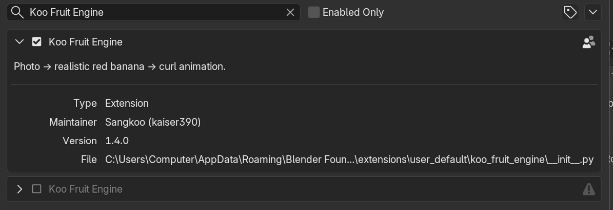

---

## 2. Quick start — 60 seconds

A walkthrough from a fresh Blender startup to a complete banana
in under a minute.

**Step 1.** Fresh Blender — default cube, empty world. Press `N` to open the
N-panel and click the **Koo Fruit** tab on the right edge.

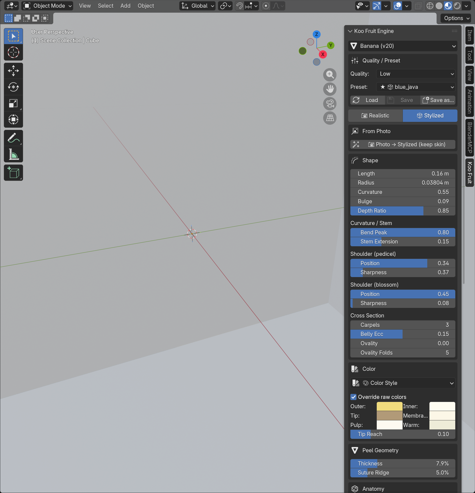

**Step 2.** Click **✨ Generate Stylized** in the Generate box.
~3 seconds later, 11 banana objects appear (peel, pulp, membrane,
bundles, seeds, …).

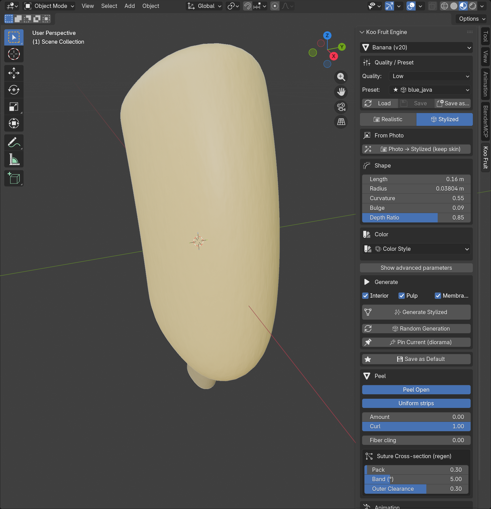

**Step 3.** Press `Z` → Material Preview to see the procedural shader
(yellow peel + cream pulp). The banana has been waiting all along —
solid shading just hides the colour.

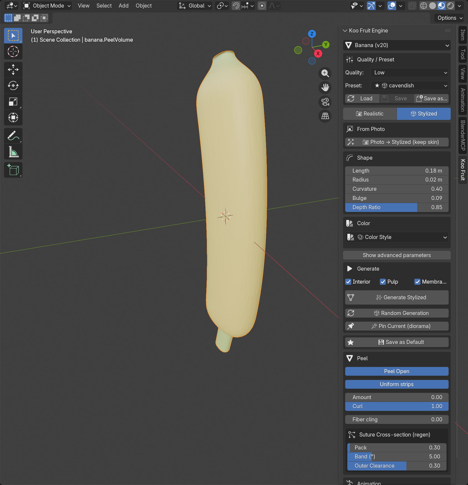

**Step 4.** Numpad `.` (Frame Selected) to centre the banana.
You're done. Slide any Shape value and re-Generate, or move on to
peeling, animation, or the photo workflow.


---

## 3. Interface overview

The entire addon lives in one N-panel section (`N → Koo Fruit`).
Top-to-bottom:

| Block | Purpose |
|------|---------|
| **Fruit Type** | Which fruit recipe to use (Banana now; Apple / Pepper / Flower will auto-register as they're added). |
| **Quality / Preset** | Mesh density (LOW / HIGH) and preset dropdown with Load / Save / Save as… |
| **📷 Realistic \| 🎲 Stylized** | Workflow tabs — switch input mode |
| **Image Source** / **Shape+Color** | Tab-dependent: photo + markers (Realistic) OR slider stack (Stylized) |
| **Generate** | The build button. Plus 📌 Pin and debug helpers. |
| **Deform** *(Realistic only)* | Reshape markers: length × / radius × / curvature Δ |
| **Peel** | Open the peel, slide strip amounts + curl |
| **Animation** | Keyframe the waterfall-close peel animation |

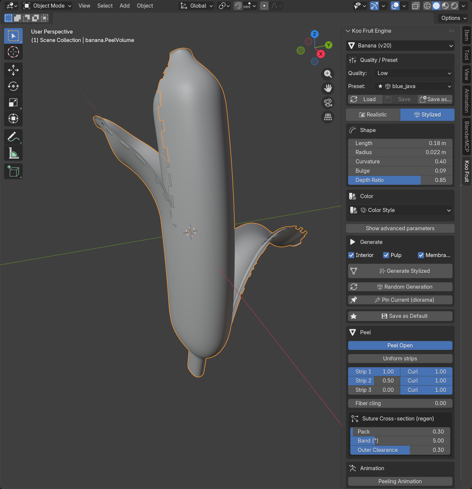

Toggle **"Show advanced parameters"** to expand into the full
parameter set (shape advanced rows, override colours, peel geometry,
anatomy, surface):

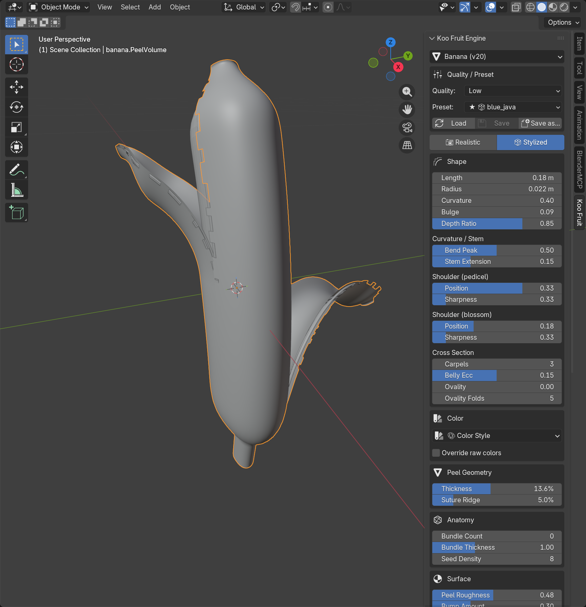

The Realistic tab (📷 selector) replaces the Shape/Color stack with
Image Source + Generate + Deform:

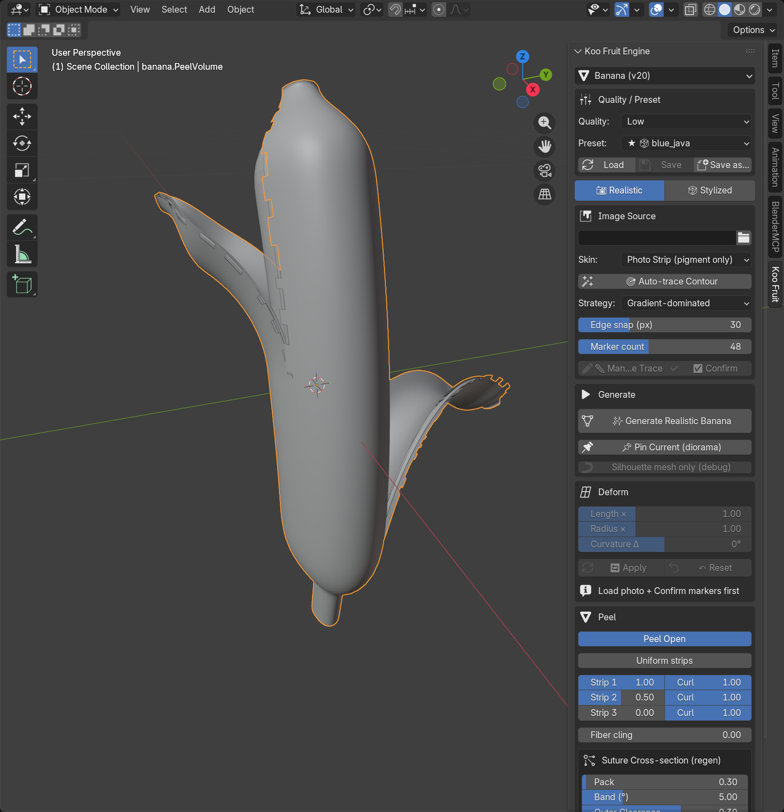

---

## 4. Realistic workflow — from photo

Produce a banana that matches a photograph pixel-for-pixel.

### 4.1 Load the photo

N-panel → **Image Source** → click the **photo path field** → pick your image.
An Image Editor opens automatically with the photo and **48 silhouette markers + 10 control markers** placed in an ellipse around it. For small or simple shapes, drop **Silhouette Markers** down to 12–16 before loading.

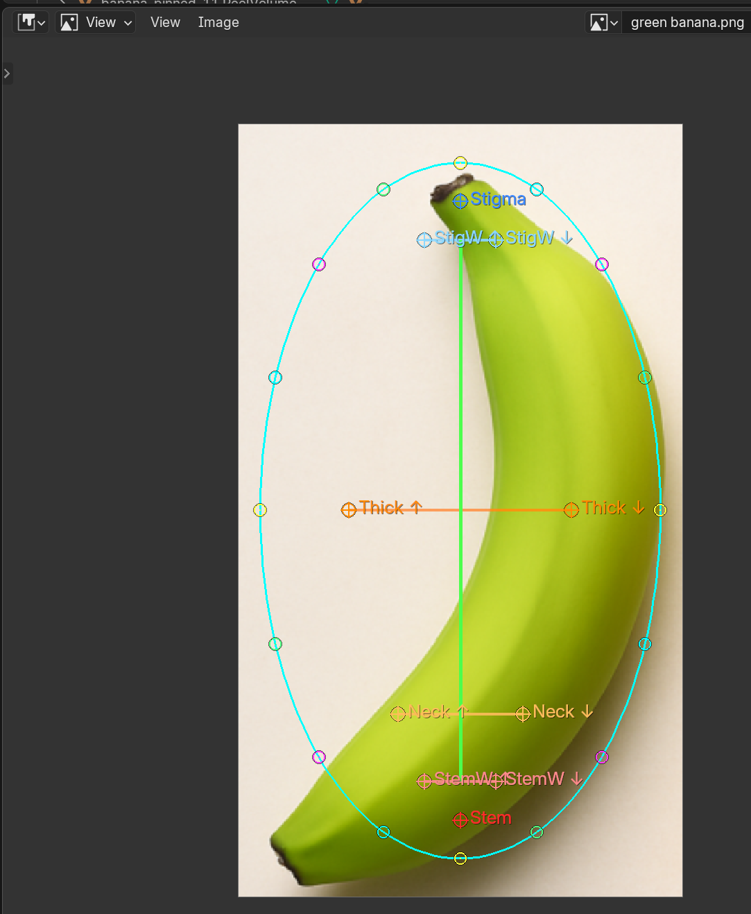

### 4.2 Trace the silhouette

Two options — pick whichever snaps to your photo better:

* **🎯 Auto-trace Contour** — detects the fruit edge automatically.
  The **Strategy** dropdown picks the detection algorithm:

  | Strategy | Best for |
  |----------|----------|
  | `ML Smart (u2netp)` | **Default.** Neural-network foreground extraction. Robust on natural backgrounds (table, cloth, wood) where the fruit and background share colors. Bundled — no download needed. |
  | `ARCHETYPE` | Clean photos with high contrast — PCA + bin extrema, filters watermarks/shadows |
  | `ARCHETYPE_SNAP` | Archetype + gradient edge snap |
  | `HYBRID` | Saturation mask + edge snap |
  | `SATURATION` | Fastest, lowest accuracy. Debugging baseline |
  | `GRADIENT_ONLY` | Matte fruit on noisy background — saturation seed + aggressive gradient pull |

  Leave **Edge snap** at 30 px for most photos; raise when the auto-trace starts far from the true edge.

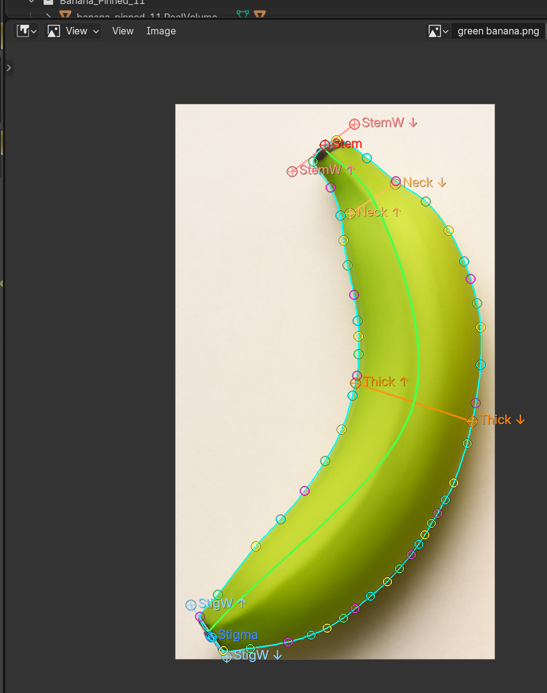

* **✏️ Manual Shape Trace** — modal click-to-aim editor. Left-click a marker to select, click again to move it. `Enter` to exit.
  Use this to nudge markers that auto-trace placed wrong, or to trace from scratch on tricky photos.

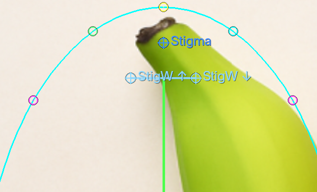

### 4.3 Confirm the markers

Once the silhouette matches the banana, click **✅ Confirm**.
The button turns red with `*` whenever markers have moved without a fresh Confirm — that's your "pending" signal.

### 4.4 Pick the skin mode

**Skin** dropdown in the Image Source block:

| Mode | What you get |
|------|--------------|
| `STRIP` | 1D saturation-weighted colour strip wrapped around the banana. Photo-accurate pigment, but photo shadows/highlights are discarded — Blender's own lighting re-shades the mesh. Recommended for stock photos with obvious studio lighting. |
| `FULL` | Planar-XZ UV maps every pixel of the photo onto the mesh. The banana looks **exactly like the photo** from the matching camera angle. Use for 1:1 reproduction; every pixel — including the photo's own lighting — prints onto the surface. |
| `AURORA` | Emission material driven by surface normals. Rainbow gradient — great for "banana lamp" or curvature visualisations. No photo needed. |

The dropdown switches the active banana's surface immediately — no
rebuild. Try a few while looking at the viewport and pick what suits
the scene.

### 4.5 Generate

N-panel → **Generate** box → **✨ Generate Realistic Banana**.

Blender thinks for a few seconds (LOW quality: ~4 s, HIGH quality: ~12 s) and your banana appears at the origin. Numpad `1` to align with the photo view.

The full sequence in viewport (photo loaded → markers built →
realistic banana with photo strip texture):

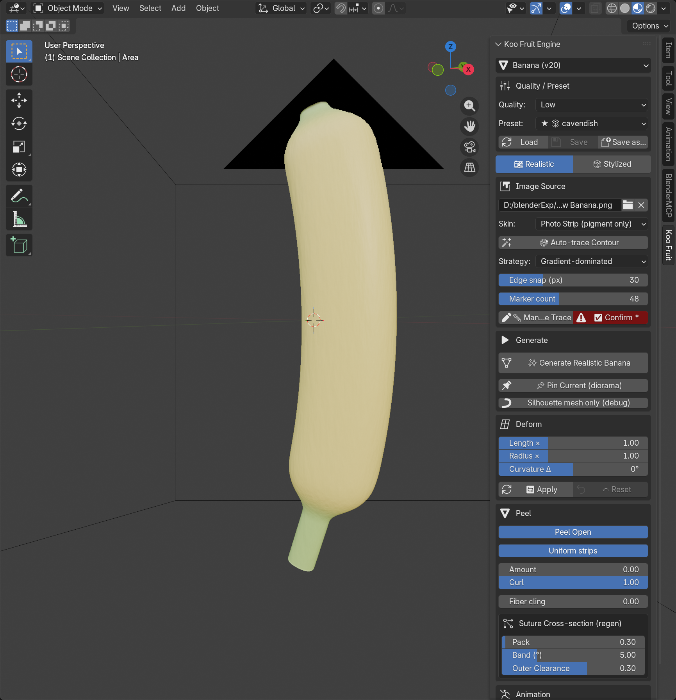

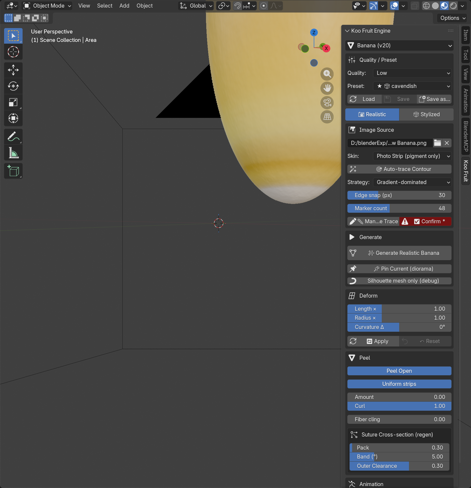

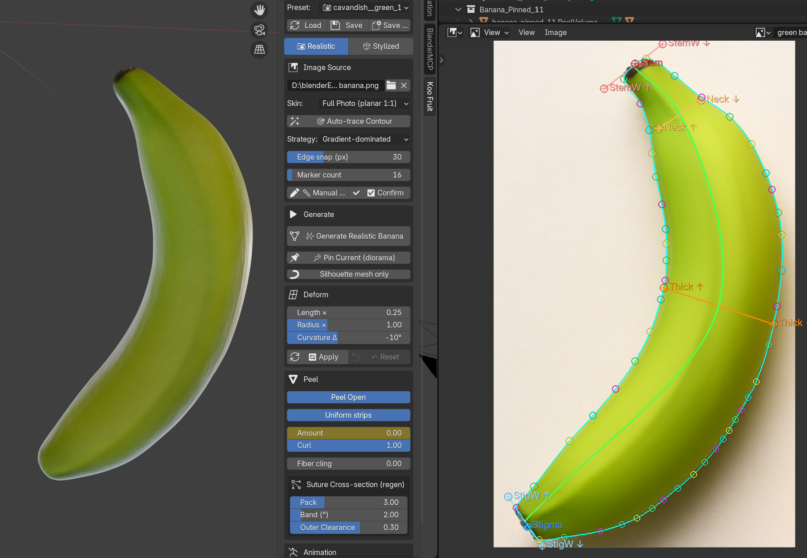

### 4.6 Iterate

Any time you drag a marker or change the skin mode, click **Generate** again. The addon clears the previous `banana.*` objects and builds fresh.

### 4.7 Switch to slider editing — keep the photo skin

Realistic banana captures the photo silhouette but locks shape into
that exact silhouette. To **edit the shape** with sliders while
**keeping the photo strip texture**, jump to the Stylized tab:

* The bridge button **📷 Photo → Stylized (keep skin)** appears at
  the top of the Stylized tab whenever a Realistic build is loaded.
* Click it. The addon measures the silhouette (length / radius /
  curvature / shoulder positions / sharpness), copies those values
  into the Stylized sliders, and rebuilds on the parametric pipeline.
* Photo strip texture stays as the peel skin. Now you can slide
  Length / Radius / Curvature freely without losing the photo-
  accurate colour.

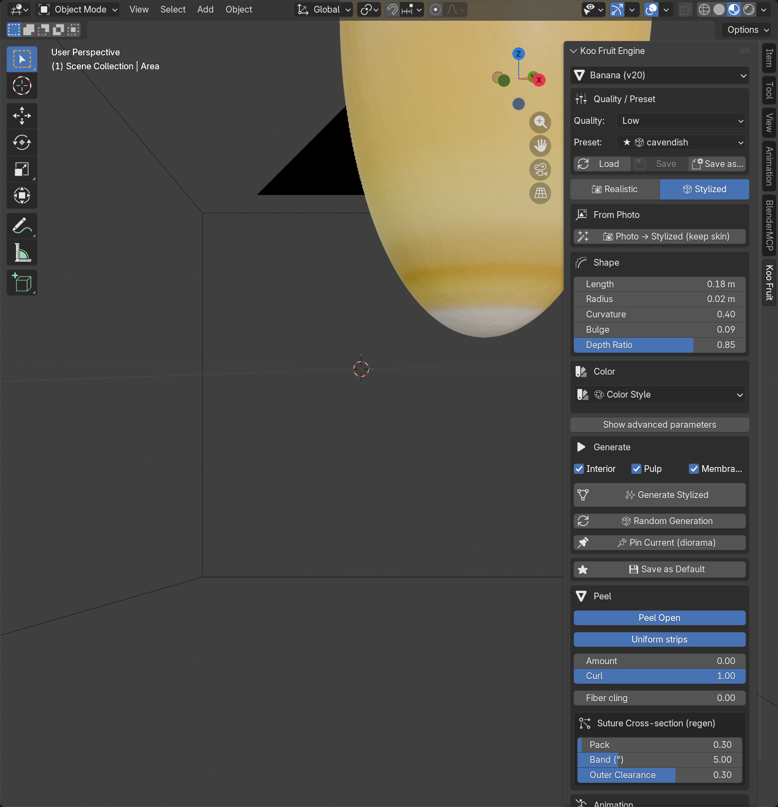

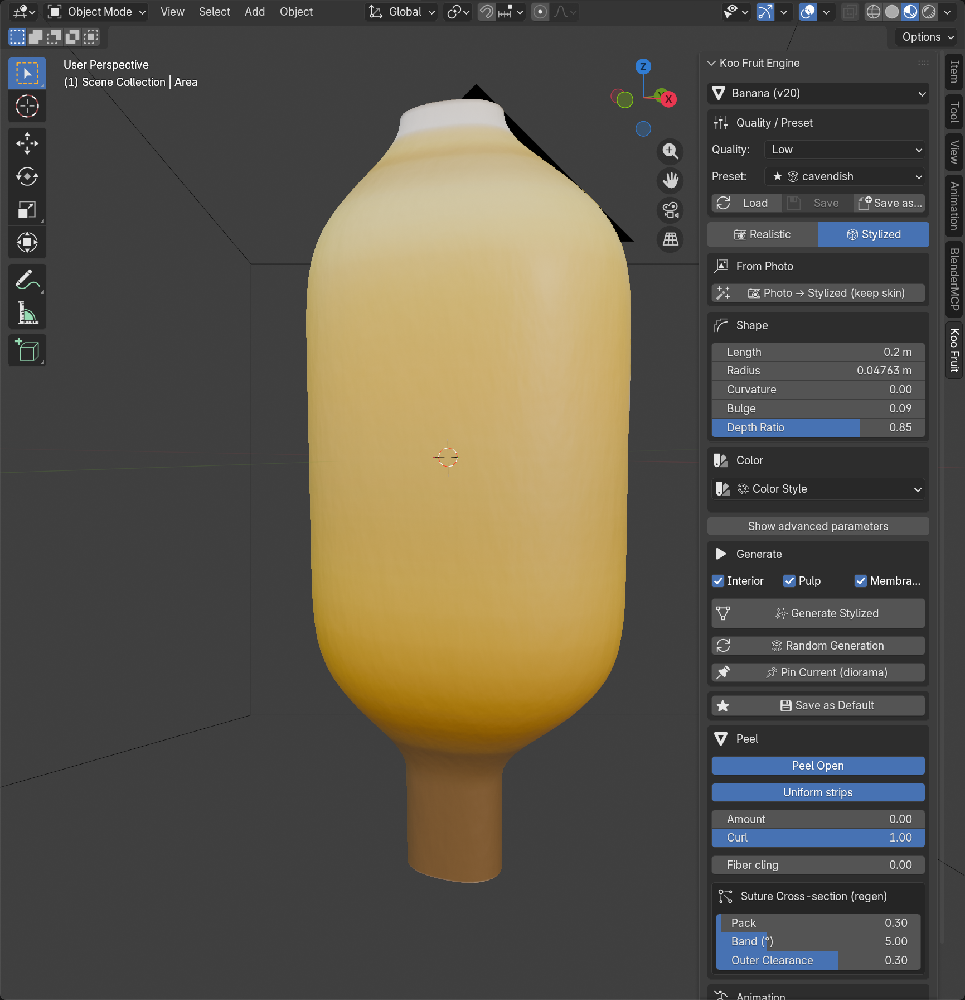

---

## 5. Stylized workflow — from sliders

No photo, no markers — pure parametric. Use when you want a clean banana of a particular cultivar, variations via randomize, or preset-driven default bananas.

### 5.1 Tab + preset

Switch to the **🎲 Stylized** tab.
**Quality / Preset** dropdown → pick any `🎲` preset (Cavendish, Blue Java, Gros Michel, Lady Finger, Manzano, Plantain, Red Banana, Burro) → **Load**.

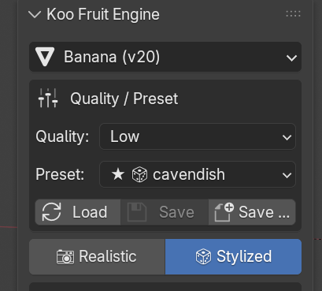

### 5.2 Photo → Stylized bridge (when a Realistic preset is loaded)

A **📷 Photo → Stylized (keep skin)** button appears at the top of the Stylized tab whenever a photo + markers are loaded. It measures the silhouette, copies the geometry into the Stylized sliders, and rebuilds on the parametric pipeline while keeping the photo strip texture as the peel skin. Used for "edit my photo banana with sliders" workflows.

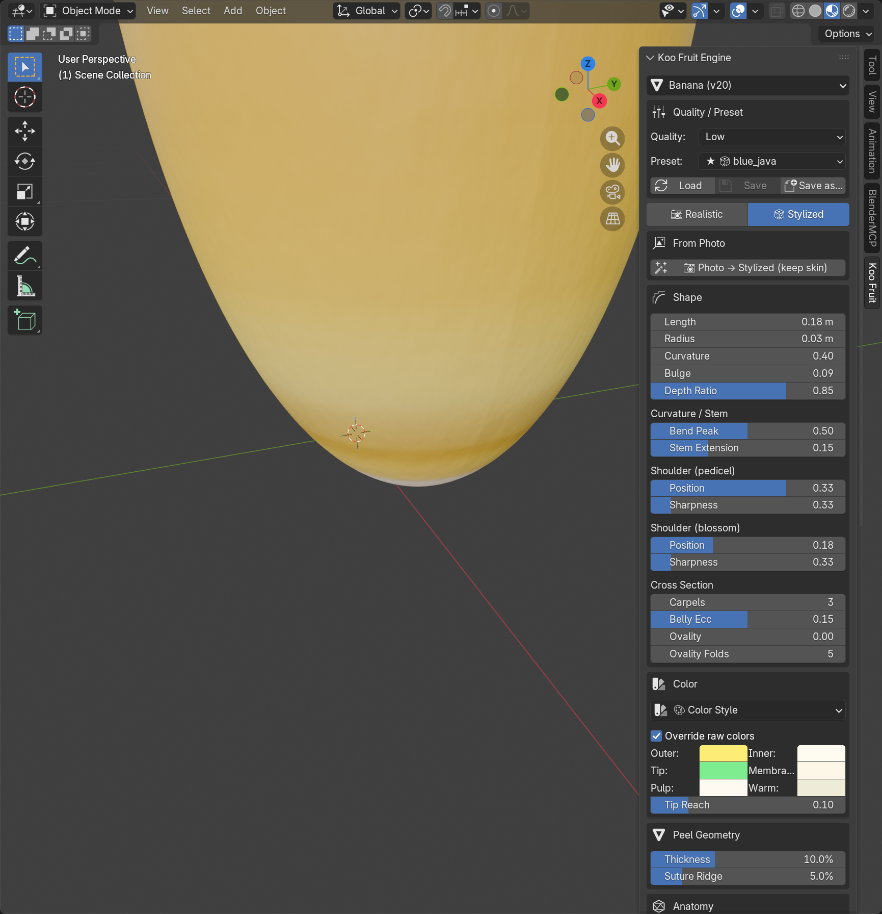

### 5.3 Shape sliders

Hero: **Length / Radius / Curvature / Bulge / Depth Ratio** — always visible.
Advanced (toggle **"Show advanced parameters"**): Bend Peak, Stem Extension, Shoulder (pedicel / blossom) Position + Sharpness, Carpels, Belly Eccentricity, Ovality + Folds.

_(See the full Stylized advanced panel screenshot in §3 for all shape
slider rows.)_

### 5.4 Color sliders

Every colour control on this panel updates the **active banana** in
milliseconds — no mesh rebuild. Pick a banana in the viewport, drag a
swatch, see the result. Pinned siblings stay untouched.

Hero: **🎨 Color Style** palette dropdown — Random / Olive / Berry /
Wood / Space / Pastel / Metallic. Picking one swaps the active
banana's palette in place (~ms). Position is preserved.

Each palette covers a different visual zone — natural palettes
(Random / Olive / Berry / Wood) keep the inside cream-coloured with a
mild outer-tint leak so the banana still reads as fruit; stylized
palettes (Space / Pastel / Metallic) blend ~50% toward the outer so
the inside visibly tracks the palette identity:

| Palette | Sample |
|---|---|
| Olive |  |
| Berry | 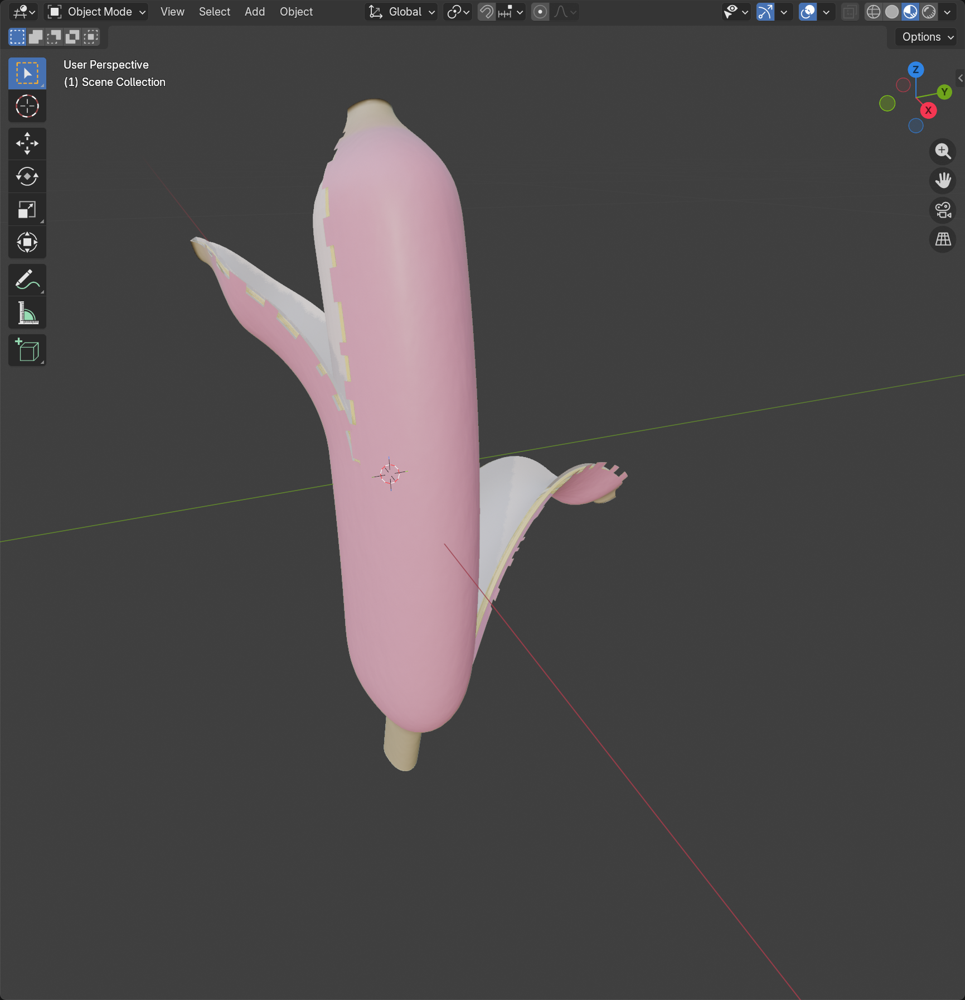 |
| Wood | 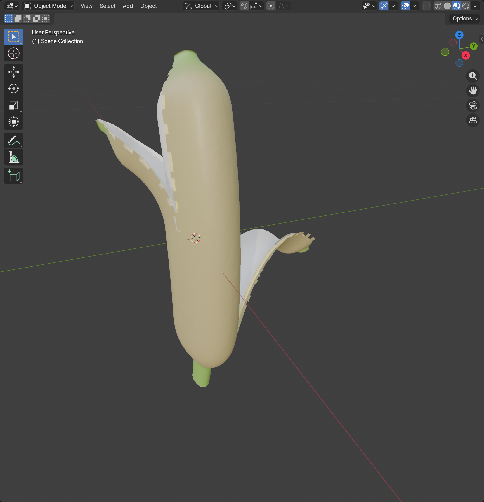 |
| Space | 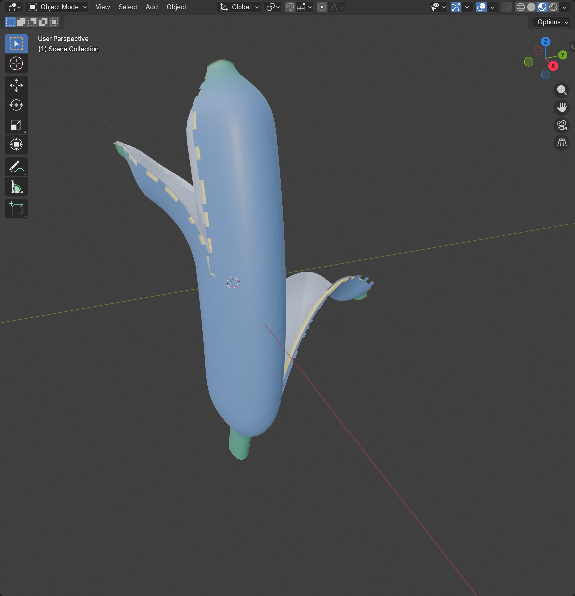 |
| Pastel | 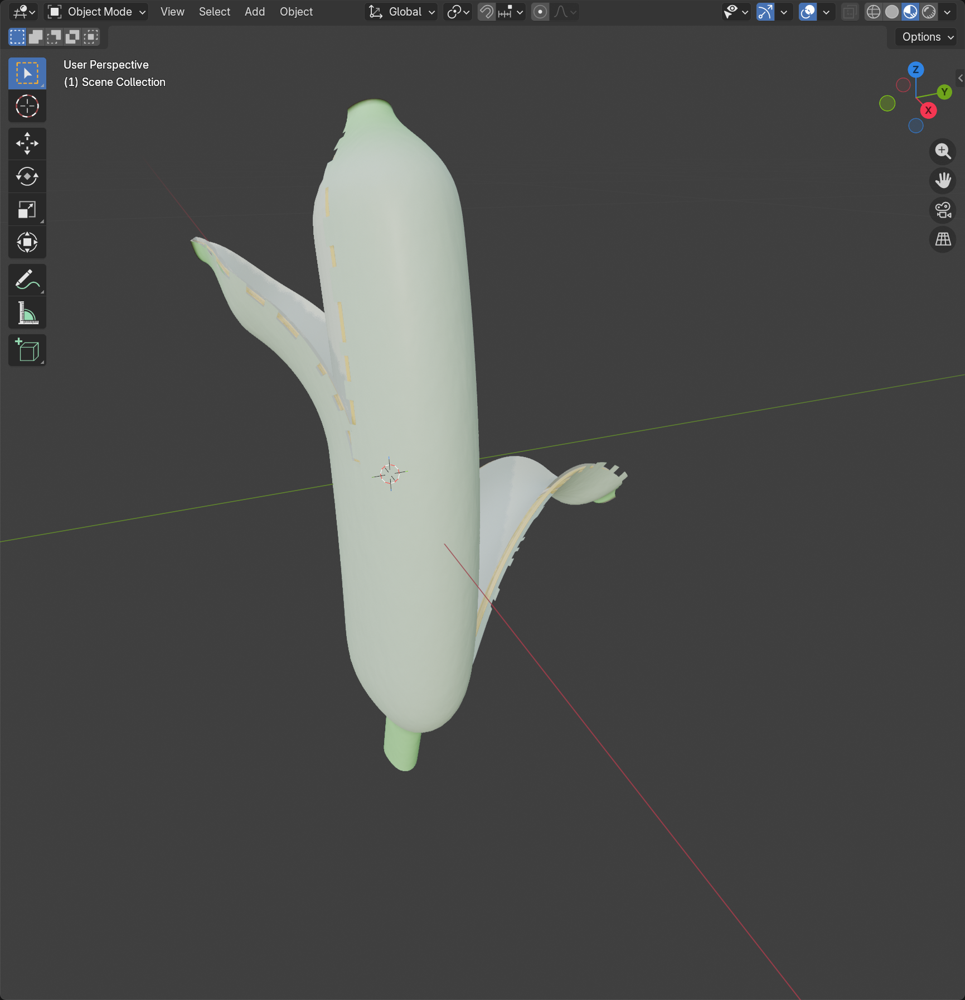 |
| Metallic | 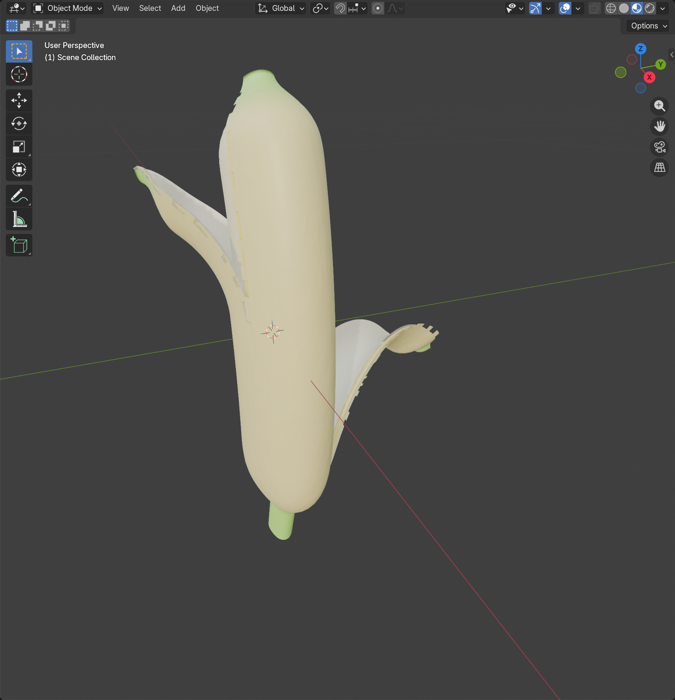 |

Advanced: **Override raw colors** unlocks per-layer pickers — Outer / Inner, Tip + Tip Reach, Pulp / Warm, Membrane / Spot. Use this when you want exact control over a specific cultivar's colour identity.

### 5.5 Peel Geometry

**Thickness (%)** of body radius (banana-size invariant — same value reads correctly on any cultivar).
**Suture Ridge (%)** of peel thickness — the raised lines that follow the 3 carpels.


### 5.6 Anatomy

**Bundle Count / Thickness** — number and thickness of the phloem fiber tubes inside the peel.
**Seed Density** — number of seed specks along the teardrop axes.


### 5.7 Surface

**Peel Roughness / Bump Amount / Bump Scale / Micro Noise** — material gloss + procedural surface texture.


### 5.8 Generate

**Include checkboxes**: ☐ Interior / ☐ Pulp / ☐ Membrane control which primitives are *built*. Unchecked → that part is not generated at all (faster Generate, smaller scene, cleaner FBX export). Toggle them off for peel-only / pulp-only variants.

**✨ Generate Stylized** — builds the banana from current sliders.
**🎲 Random Generation** — rolls every advanced slider to plausible-banana values and builds immediately. One click = **one more** fruit added to the scene (the previous default banana is auto-pinned aside, never overwritten). Bundle count + thickness intentionally NOT randomized (quality choices, not visual identity). Strength slider in the redo panel scales the spread.


Everything else in the JSON schema (~40 more parameters — tube radii, honey bezier controls, per-primitive roughness, SSS settings) stays file-editable. See [§12 Advanced — JSON-editable parameters](#12-advanced--json-editable-parameters).

---

## 6. Peeling the banana

The **Peel** block appears after Generate. Works in both tabs.

### 6.1 Basic — Peel Open

Toggle **Peel Open** to enable peel interaction. Three strip sliders appear:

| Slider | What it does |
|-------|-------------|
| Strip 1 / 2 / 3 Amount | How far each of the three peel strips is pulled back (0 = closed, 1 = fully peeled to the stem anchor) |
| Curl | Per-strip curl amount — controls how tightly the peeled strip rolls up |
| Fiber cling | 0 = fibers curl with the peel; 1 = fibers stay on the flesh |

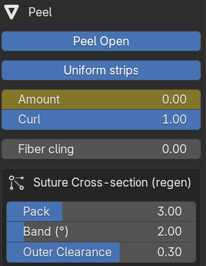

Strip Amount sweeps from closed to fully open in one continuous slide:

| Strip Amount | Result |
|---|---|
| 0.0 (closed) | 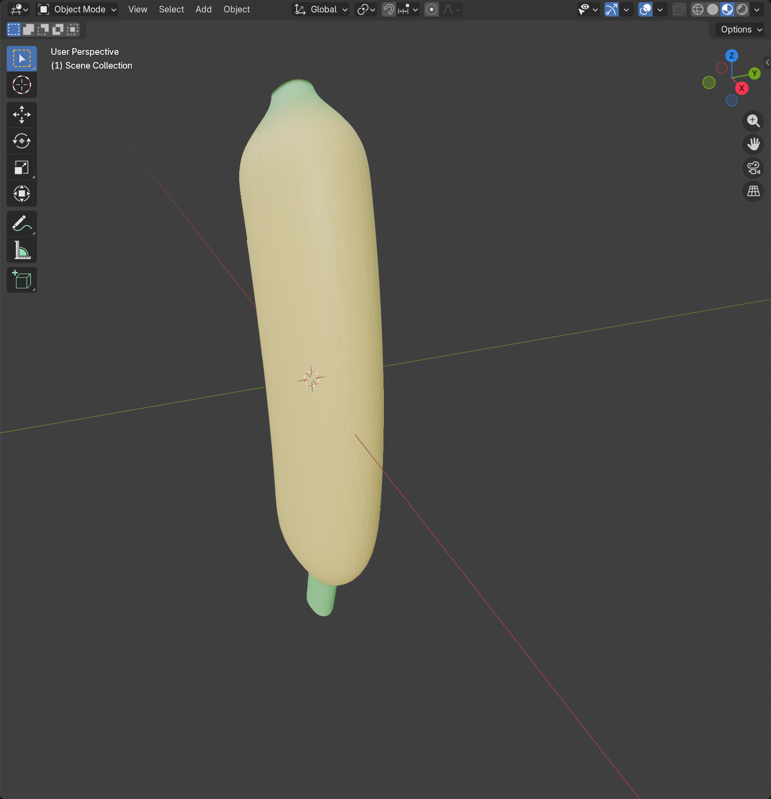 |
| 0.5 (half open) | 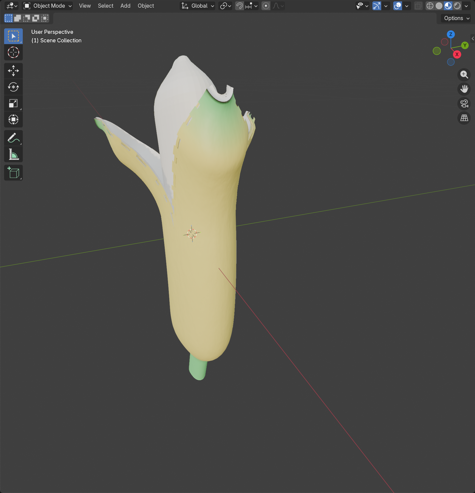 |
| 1.0 (fully open) | 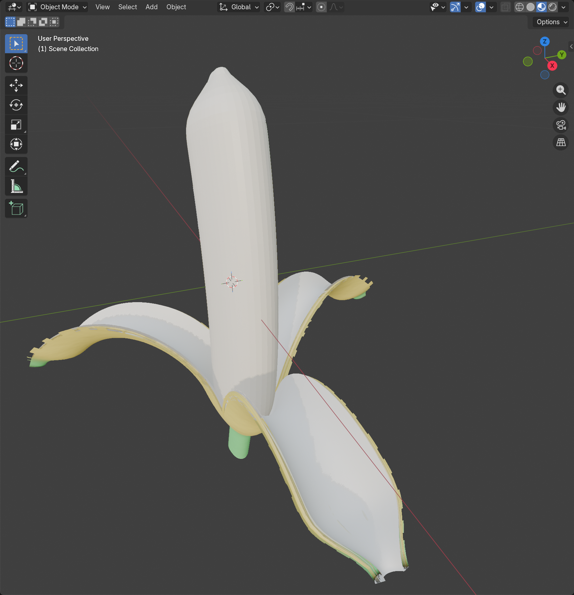 |

### 6.2 Uniform mode

Turn on **Uniform strips** to drive all three strips with one Amount + Curl pair. Fast way to open the whole peel symmetrically.

### 6.3 Suture cross-section

Only shows when the peel is open. Three knobs control the bundle pack that shows at the torn edge:

* **Pack** (0–10): how many extra bundles go near each suture line. 0.3 default; 10 gives 11× the body bundle count clustered at the sutures.
* **Band (°)**: angular half-width of the Gaussian cluster around each suture.
* **Outer Clearance**: fraction of the peel-layer span reserved near the epidermis — keeps bundles from shadowing through the outer shell.

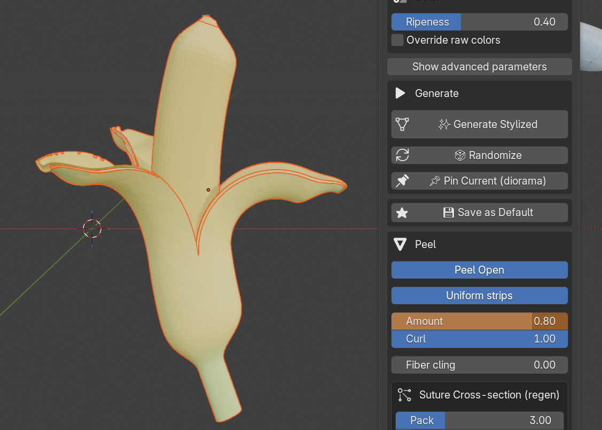

### 6.4 Cylinder-shoulder sticker lift *(new in t1.4.3)*

When the shoulder is near-flat — `shoulder_sharpness_pedicel` and
`_blossom` both below 0.30 (e.g. cylindrical novelty bananas, lady-
finger types, or mid-Generate sweep tests) — the strip's natural curl
at small `Amount` is too small to clear the shoulder line and the
strip self-intersects the body. From t1.4.3 onward the strip lifts
radially outward like a sticker peel for the first ~12% of `Amount`,
then natural curl takes over smoothly.

No new slider — the lift engages automatically when both shoulder
sharpness sliders fall below the threshold; default banana
(sharpness ≈ 0.33) sees no behaviour change.

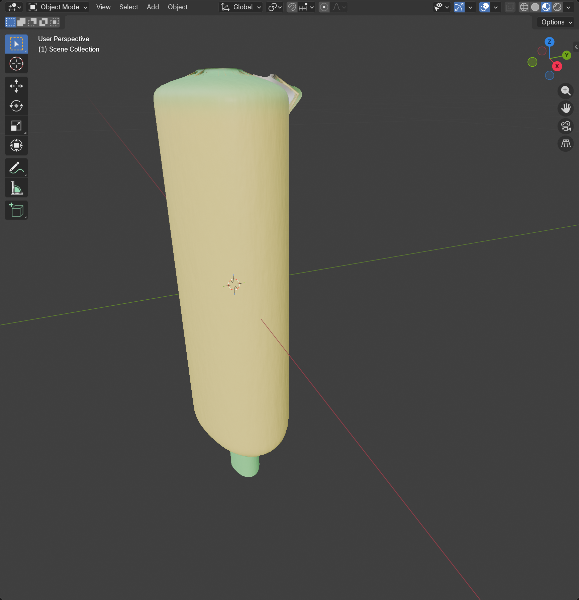

---

## 7. Peel animation

### 7.1 Enable

**Animation** block → toggle **Peeling Animation**.

Keyframes install immediately on the three strip-amount sliders and the timeline jumps to `[1 .. F_end]`.

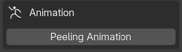

### 7.2 Scenario

The built-in scenario is a cascade open + simultaneous close:

1. Strip 1 opens alone, hitting 50 % at one phase_duration.
2. At that moment Strip 2 starts; it hits 50 % one phase later.
3. At *that* moment Strip 3 starts; it hits 50 % another phase later.
4. All three reverse — reach 0 at the same final frame.

Default `phase = 20`, `close = 20` → total 80 frames. Adjust the two sliders and the keyframes re-install automatically.

Press `Spacebar` in the 3D viewport or the Timeline's ▶ Play to watch.

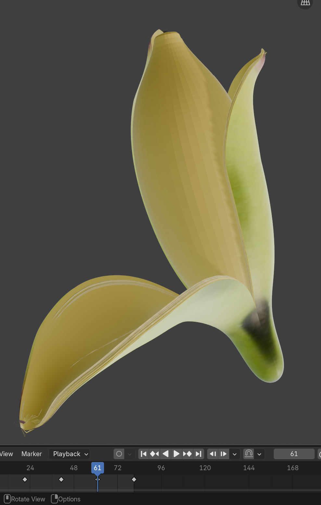

### 7.3 Disable

Turn the toggle off to remove the keyframes — sliders become static again.

---

## 8. Deform — reshape an existing banana

Only in the **Realistic** tab, since it transforms markers. The sliders apply to the markers and rebuild the silhouette — so the photo UV re-projects onto the new outline, no stretch artefact.

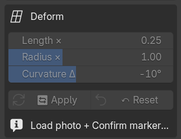

### 8.1 Sliders

| Slider | Meaning |
|-------|---------|
| Length × | Scale along the stem→stigma axis (0.5–2.0 soft range) |
| Radius × | Scale perpendicular to the axis (same range) |
| Curvature Δ | Additional bend on top of the photo's natural curvature |

All three are **relative to the original markers** captured on the first Apply — sliders at `1 / 1 / 0` = no change.

### 8.2 Apply

**🔄 Apply** transforms markers and rebuilds. Baseline is captured automatically on the first Apply.

**↶ Reset** restores the original markers and resets the sliders.

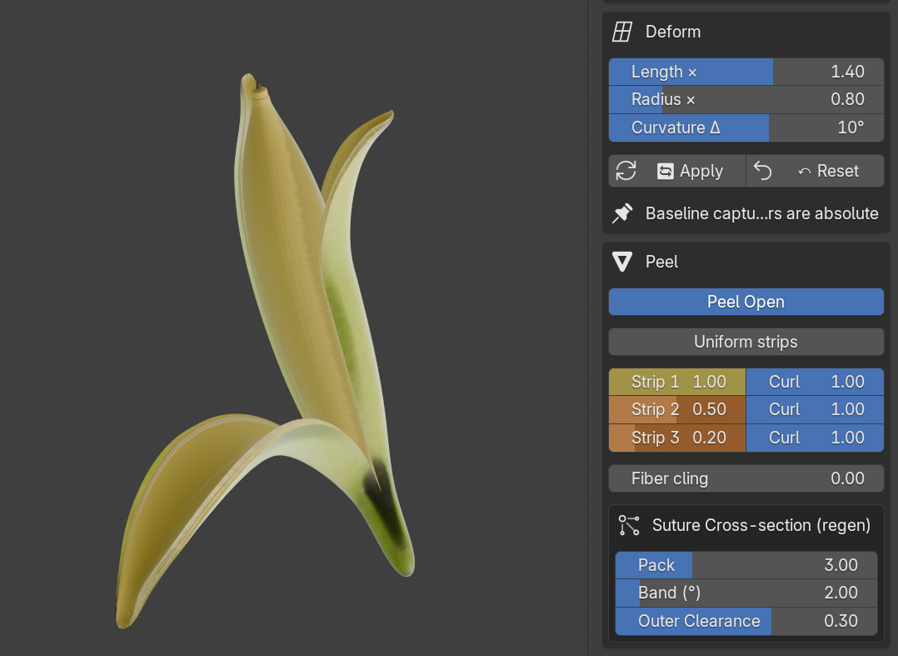

---

## 9. Diorama — multiple bananas in one scene

The addon builds one **active** banana at a time (each Generate clears the previous `banana.*` objects). To keep multiple bananas in the scene side-by-side — for a variety pack render, say — use **📌 Pin Current**.

### 9.1 Workflow

1. Generate banana #1 (any tab).
2. **📌 Pin Current (diorama)** in the Generate box.
   * Every `banana.*` object is renamed to `banana_pinned_1.*`, moved into a new `Banana_Pinned_1` collection, and translated aside along +X.
3. Change preset / sliders / photo / whatever.
4. Generate banana #2 → appears at origin, pinned_1 still visible.
5. **📌 Pin Current** again → pinned_2 lands next to pinned_1.
6. Rinse + repeat. Frame + render.

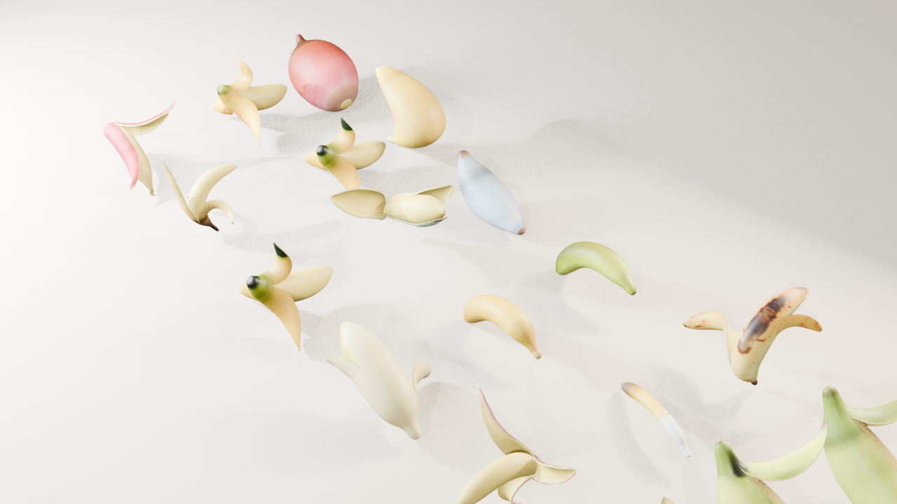

### 9.2 Per-banana editing — click any banana to edit

Each banana the engine builds — pinned or active — is self-describing.
Click any part of it (peel, pulp, bundles, …) in the viewport and the
panel rewires to that banana's state:

* The panel sliders (length, radius, curvature, peel curl, color,
  skin choice) reflect the clicked banana.
* A **Selected Banana** box appears at the top of the panel showing
  the banana's identity and which mode (Realistic / Stylized) it
  was built from.

Tweak the panel and press **Apply Mesh Changes** in the Selected
Banana box — the addon rebuilds **that banana in place**, leaving
its sibling bananas untouched. Multi-banana scenes therefore keep
an editable state for every banana in the scene, not just the most
recent build.

The Selected Banana box now hosts a single button. Colour, skin, and
material slider drags update the active banana live (no rebuild),
so the panel stays clean — Apply Mesh Changes is reserved for shape
edits (length / radius / curvature / n_carpels) that need a fresh
mesh.

### 9.3 Caveats

* The mesh has to be rebuilt for shape / topology / curl-bake changes
  (Apply Mesh Changes button). Slider tweaks that touch only colour /
  skin / material update live without rebuild.

---

## 10. Presets — save and load your bananas

**Quality / Preset** block at the top of the panel. Every preset is a JSON file that captures the full parameter state + (for realistic presets) the markers and photo path.

### 10.1 Dropdown icons

| Prefix | Meaning |
|--------|---------|
| `★` | Built-in preset (locked, can't overwrite — fork via Save as…) |
| `🎲` | Parametric preset (Stylized-friendly) |
| `📷` | Has markers + photo block (Realistic-friendly) |

Built-in examples: `★ 🎲 cavendish`, `★ 📷 realistic_red_banana`.

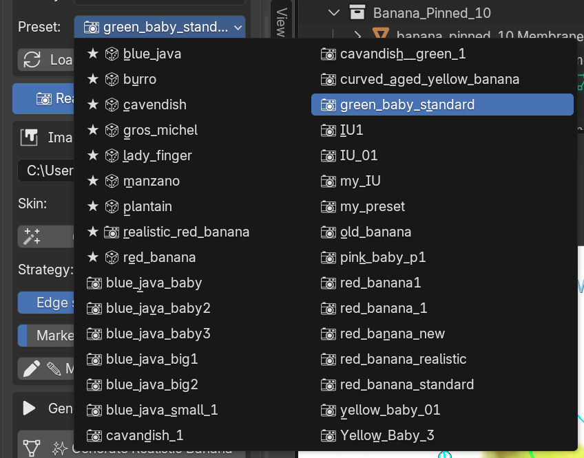

### 10.2 Buttons

| Button | Action |
|--------|--------|
| **Load** | Apply the selected preset to the scene |
| **Save** | Overwrite the currently selected user preset (disabled for built-ins) |
| **Save as…** | Write to a new name |

### 10.3 Save as Default *(Stylized tab only)*

Found at the bottom of the Stylized tab. Writes the current state to the well-known `user_default` preset slot. Reload any time via the dropdown to return to your personal default banana.

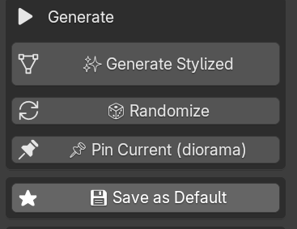

---

## 11. Render guide — get a hero shot

The procedural shader uses vertex colours + procedural bump as Base
Color, so the look depends heavily on lighting. A poor light setup
makes any banana read flat or washed out — get this right before
exporting renders.

### 11.1 Material preview ≠ render

Switch the viewport to **Material Preview** (top-right shading icons,
or `Z` → Material Preview) to see colours interactively. This uses
Blender's matcap-style preview lighting and is **always vivid** —
it's a different lighting setup from F12 render. Don't be surprised
if the F12 render looks different.

### 11.2 World HDRI — the single biggest lighting decision

`Properties → World → Surface → Background → use Image Texture` and
load an `.exr`. Blender ships built-in HDRIs at:

```
{blender install}/{version}/datafiles/studiolights/world/
  sunrise.exr   forest.exr   interior.exr   night.exr
```

**Strength** controls how dominant the HDRI is in lighting:
- **0.2 ~ 0.5**: vivid product-shot look, banana yellow stays
  saturated. Recommended for hero shots.
- **0.8 ~ 1.5**: outdoor daylight feel, banana reads pale-cream.
  Good for "in the wild" scenes.
- **>2.0**: blown out, banana looks white. Avoid.

### 11.3 Outdoor vs indoor HDRI — same banana, different read

| Outdoor (sunrise.exr, strength 0.25) | Indoor (interior.exr, strength 0.25) |
|---|---|
| 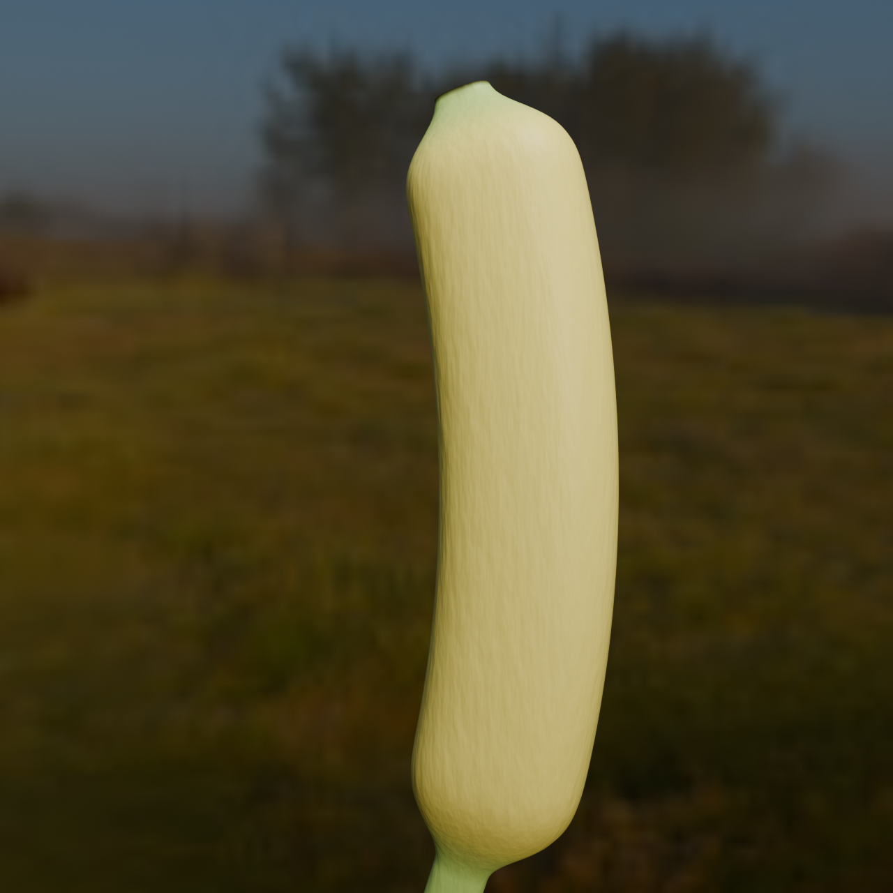 | 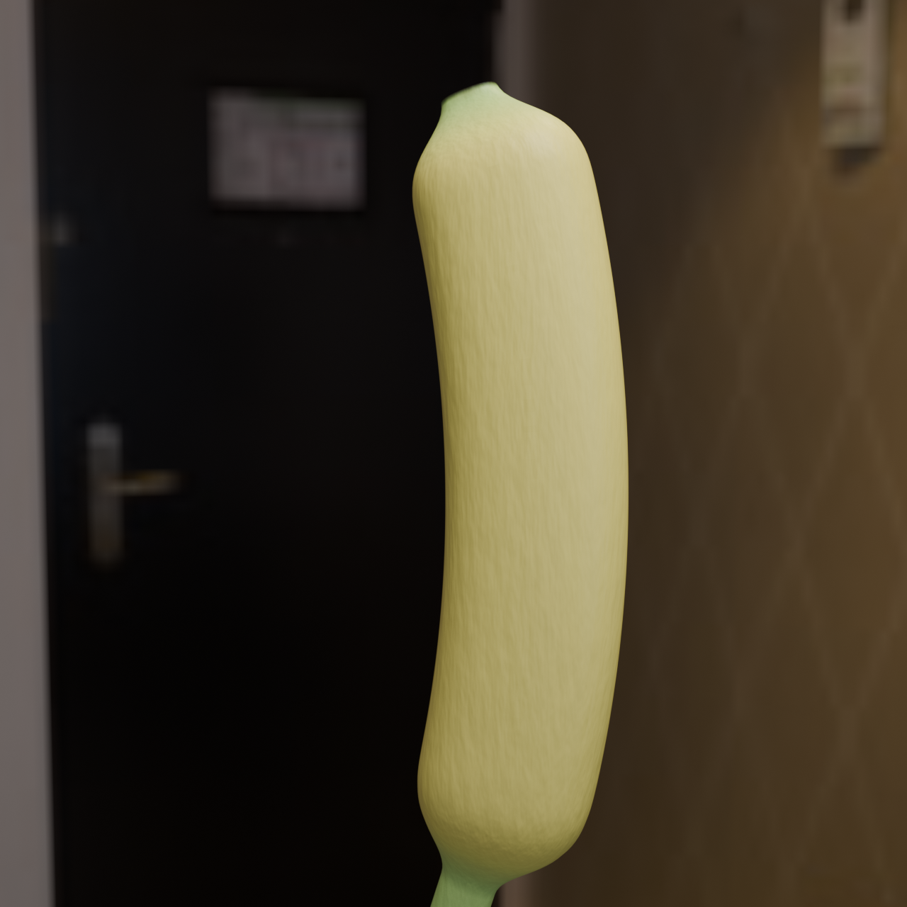 |

Outdoor: bright sky lighting → pale cream banana, washed-out
saturation. Indoor: warm interior lighting → vivid yellow with
visible green tip.

### 11.4 Eevee vs Cycles

Both engines use the same shader. The differences:

| | Eevee | Cycles |
|---|---|---|
| Speed (1280×1280, 1 frame) | ~1 s | ~30 s (32 samples) |
| SSS quality | Approximate (real-time) | Path-traced (true) |
| Bundle / fiber translucency | Approximate | Accurate |
| Final render fidelity | "Looks great" | "Looks photorealistic" |

For Adrian / Superhive submission shots — **Cycles**.
For animation playback / iteration — **Eevee**.

| Eevee (indoor) | Cycles (indoor) |
|---|---|
|  | 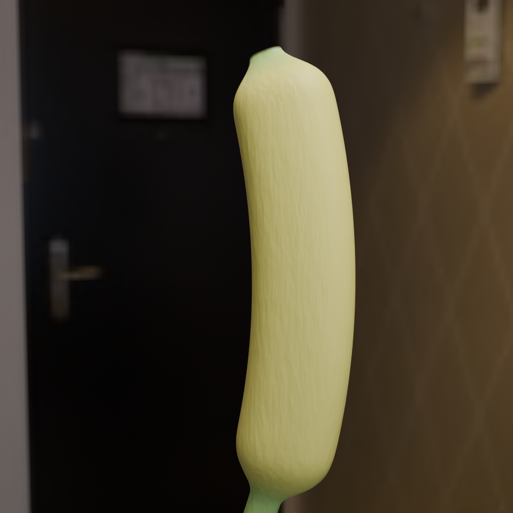 |

In good lighting the difference is subtle. In dramatic lighting
(strong rim light, deep shadows, SSS through thin pulp) Cycles wins.

### 11.5 Camera framing

For a single-banana hero shot:
* Camera lens: **50–60 mm** (50 = natural, 60 = slight compression)
* Camera height ≈ banana mid-Z (so the banana fills the frame
  vertically, not diving down or pointing up)
* Distance: ~3 × banana length (so the banana occupies ~70% of frame
  height, with 15% margin top + bottom)
* Slight azimuthal angle (30–45°) reads more sculptural than a flat
  side view

```python
# Camera setup snippet (paste into Blender's Python console):
import math
cam = bpy.data.objects["Camera"]
cam.location = (0.20, -0.28, 0.04)
cam.rotation_euler = (math.radians(85), 0, math.radians(36))
cam.data.lens = 60
```

### 11.6 Output settings checklist

* `Properties → Output` → resolution **1280×1280** for thumbnails,
  **2048×2048** for hero shots
* Eevee: enable **Bloom** for honey-halo glow, **Screen-space
  reflections** off (peel is matte) or low strength
* Cycles: 32 samples test, **128 samples** final, **Denoise** ON
  (OptiX or NLM)
* `Properties → Color Management → Look` = **High Contrast** for
  product-shot punch, **Standard** for accurate colours

---

## 12. Tips & troubleshooting

### Geometry / mesh issues

**The peel / pulp pokes out of the silhouette.** On highly-curved bananas
this can happen at the narrow stem neck. Workaround: in the Realistic
tab, drag the **Neck** markers slightly into the body (toward the
thick midpoint). That shrinks the pulp's axial range so it stays
clear of the narrow region.

**Cylinder banana with low shoulder sharpness has a flickering peel
strip.** From t1.4.3 the peel strip lifts radially (sticker mode) at
small Amount when both shoulder sharpness sliders are below 0.30.
This is correct behaviour — see §6.4. If you want the old slide-into-
shoulder behaviour, raise sharpness to ≥0.30.

**Random Generation produces extreme bananas sometimes.** Lower the
Variation Strength slider in the Random Generation operator's redo
panel (`F9`). 0.0 = defaults only; 0.7 (default) = wide range.

### Color / material issues

**Random Color makes everything look the same.** Fixed in t1.4.3 —
each palette now visibly tints the inner layers. If you still see
identical inners, you're on an old version (check
`Edit > Preferences > Get Extensions > Koo Fruit Engine` shows
**1.4.3-test**).

**The banana renders pale/white instead of yellow.** The procedural
shader uses vertex colours as Base Color; bright HDRI strength
(>1.5) washes saturated yellow toward cream. Drop World HDRI
strength to 0.25–0.5 (see §11.2).

**Photo looks tiled or smeared on the back of the peel.** The planar-
XZ UV is mirror-symmetric about the Y axis by design — the back gets
the mirrored photo. From the camera angle that shot the original
photo, this is invisible. If you render from the opposite side,
expect mirrored pigment.

**Vertex colours don't show in viewport.** Switch viewport shading
from `Solid` to `Material Preview` (top-right shading icons or `Z`).
Solid mode shows uniform gray.

### Workflow / panel issues

**Markers auto-place back to the default ellipse when I load a
preset.** Fixed in v1.3. If you still see it, make sure the preset was
saved in v1.3+ (it'll have `markers_version` in its JSON).

**Photo → Stylized button doesn't show.** It only appears when a
Realistic build with markers + photo is loaded. If your photo has no
markers yet, click **Build silhouette markers** in the Realistic tab
first. The button uses `bpy.ops.fruit.realistic_to_stylized.poll()`
to gate visibility.

**Confirm button is red with `*` after I touch a marker.** That's
the dirty-state signal — markers have moved without a fresh build.
Click Confirm or **Generate Realistic Banana** to clear it.

**Save as Default doesn't persist after Blender restart.** It saves
to the `user_default` preset slot. Verify by reopening the preset
dropdown after restart — `user_default` should be present and Load
should restore your values.

### Performance

**Generate is slow.** Drop **Quality** from `HIGH` to `LOW` — still
production-grade mesh density (48 × 60 rings, 60 bundles). LOW
~3 s, HIGH ~30+ s.

**I have 100 bananas in the scene and Blender is sluggish.** Each
Pin creates a separate set of 11 mesh objects (~100k verts × 11 ≈ 1M
verts at LOW). For diorama scenes >50 bananas, generate at LOW and
consider decimating the inner pulp/bundles after Pin (they're
mostly hidden anyway).

**Cycles render takes minutes.** 32 samples is preview, 128 is
final. Use OptiX denoise (`Properties → Render → Sampling → Denoise
→ OptiX`) to cut effective sample count by 4×.

### Export / interchange

**FBX export loses the procedural shader.** Procedural shaders don't
survive FBX export (Unity / Unreal / Maya can't replay Blender's
node graph). Bake materials before export: `Properties → Render →
Bake → Diffuse → bake to texture`, then export FBX with the baked
texture maps. The vertex colours survive — most engines can read
them as a `COLOR_0` attribute.

**glTF export looks correct but bigger than expected.** Procedural
bumps are baked into normal maps during glTF export, which adds
texture file size. For tight asset packs, bake at 1024×1024 instead
of the default 2048.

### Other

**I want to change a parameter that's not in the N-panel.** See
[§13 Advanced — JSON-editable parameters](#13-advanced--json-editable-parameters).

**Addon didn't install / can't find Koo Fruit tab.** Blender 4.2+ is
required. For 4.2 LTS you may need to enable "Extensions" in
Preferences first.

**Where do I report a bug?** Email the maintainer with:
1. Blender version (`Help → About`)
2. Extension version (Preferences → Get Extensions → Koo Fruit Engine)
3. Steps to reproduce
4. The `.blend` file (Save the offending state)
5. Console log if there's a Python traceback

---

## 13. Advanced — JSON-editable parameters

The N-panel exposes ~22 curated hero parameters. The JSON preset schema defines ~60+ more. To edit them:

* **User preset**: edit `%APPDATA%/Blender Foundation/Blender/5.0/config/fruit_engine/presets/<name>.json`, then `Load` from the dropdown.
* **Built-in**: fork via Save as… first; the built-ins stay read-only.

Full UI-vs-JSON mapping table:
[`docs/stylized_params_advanced.md`](stylized_params_advanced.md)

Each preset value corresponds to a registered parameter in
`addon/koo_fruit_engine/data/parameters/banana.json`
— same schema for every fruit archetype.

---

## 14. Parameter reference

This appendix is generated from the live property definitions on `scene.fruit_engine`. **179 parameters** across **8 groups**; **56** are exposed in the N-panel (UI Label column shows the slider name as it appears in Blender). The remaining 123 are JSON-only — edit the preset file to access them (see §13).

### `meta` group

| UI Label | Path | Type | Default | Min / Range | Max | Description |
|----------|------|------|---------|-------------|-----|-------------|
| **Preset** | `meta.preset_selection` | enum | `` |  |  | Choose a cultivar — auto-applies to the 3D viewport |
| **🔬 Profile Generate** | `meta.profile_generate` | bool | False | — | — | Time each pipeline stage and dump a breakdown to comms/profile_generate_result.txt on every Gener… |
| **Show advanced parameters** | `meta.stylized_show_advanced` | bool | False | — | — | Reveal the extra 10+ parametric knobs (shoulder sharpness, ovality, spot density, peel thickness,… |
| — | `meta.auto_regen` | bool | False | — | — | When on, regenerate 0.3s after any geometry / material parameter change.  Default OFF in koo — us… |
| — | `meta.autosave_last_state` | bool | True | — | — | Write current parameter values to disk after every regenerate, so the next Blender session starts… |
| — | `meta.fruit_type` | enum | `` |  |  | Which fruit archetype to generate |
| — | `meta.generate_mode` | enum | `REPLACE` | `REPLACE`, `ADD` |  | What to do with this archetype's existing objects |
| — | `meta.quality` | enum | `LOW` | `LOW`, `HIGH` |  | Mesh density / render fidelity |
| — | `meta.render_style` | enum | `REALISTIC` | `REALISTIC`, `STYLIZED` |  | REALISTIC = full SSS + specular + normal detail. STYLIZED = flatter shading + saturated colors + … |
| — | `meta.rng_base_seed` | int | 42 | 0 | 2147483647 | Global RNG anchor. Change to produce variant models |
| — | `meta.ui_mode` | enum | `TOY` | `TOY`, `ADVANCED` |  | Toy = 6 hero sliders, fun-first layout. Advanced = full 50+ parameter control. |
| — | `meta.workflow_mode` | enum | `REALISTIC` | `REALISTIC`, `STYLIZED` |  | Realistic = photo + markers pipeline. Stylized = parametric shape/color sliders, no photo needed. |

### `shape` group

| UI Label | Path | Type | Default | Min / Range | Max | Description |
|----------|------|------|---------|-------------|-----|-------------|
| **Belly Ecc** | `shape.belly_eccentricity` | float | 0.15 | 0 | 0.3 | Cross-section offset toward the convex (belly) side. 0 = symmetric, 0.15 = Cavendish observed, 0.… |
| **Bulge** | `shape.bulge` | float | 0.085 | 0 | 0.5 | Carpel bulge factor (1 + bulge·cos(3θ)). Higher = more pentagonal cross-section |
| **Ovality** | `shape.cross_section_ovality` | float | 0 | 0 | 0.3 | Secondary ridge amplitude (0 = rounded / no secondary ridges, 0.3 = strong). Sign is visually a n… |
| **Ovality Folds** | `shape.cross_section_ovality_folds` | int | 5 | 2 | 12 | Secondary ridge frequency around the cross-section. Default 5 combined with 3-fold carpel bulge g… |
| **Bend Peak** | `shape.curl_peak_frac` | float | 0.5 | 0.2 | 0.8 | Where along the length the curvature peaks. 0.5 = symmetric arc; <0.5 = peak near pedicel |
| **Curvature** | `shape.curvature` | float | 1 | 0 | 2 | Bend amount (0 = straight) |
| **Curvature Δ** | `shape.deform_curvature_delta` | float | 0 | -1 | 1 | ADDITIONAL bend applied on top of the original banana's natural curvature. 0 = no change (natural… |
| **Length ×** | `shape.deform_length_scale` | float | 1 | 0.5 | 2 | Scale along the stem→stigma axis before rebuild |
| **Radius ×** | `shape.deform_radius_scale` | float | 1 | 0.5 | 2 | Scale perpendicular to the stem→stigma axis before rebuild |
| **Depth Ratio** | `shape.depth_ratio` | float | 0.85 | 0.5 | 1 | Cross-section aspect: depth / width |
| **Length** | `shape.length` | float | 0.22 | 0.05 | 1 | Banana length in meters |
| **Radius** | `shape.radius` | float | 0.03 | 0.005 | 0.2 | Cross-section half-radius in meters |
| **Sharpness** | `shape.shoulder_sharpness_blossom` | float | 0.33 | 0 | 3 | Curvature at the blossom-end shoulder. Same semantics |
| **Sharpness** | `shape.shoulder_sharpness_pedicel` | float | 0.33 | 0 | 3 | Curvature at the stem-end shoulder. <1 = plump (cylinder), >1 = skinny (pencil-like). 0 ≈ fully f… |
| **Stem Extension** | `shape.stem_extension_frac` | float | 0.15 | 0 | 0.5 | Fraction of body length the cluster projects past u=0 as an emergent pedicel stub (peel + bundles… |
| **Position** | `shape.taper_shoulder_frac` | float | 0.33 | 0.05 | 0.45 | Length fraction of the wide pedicel-side shoulder |
| **Position** | `shape.taper_tip_frac` | float | 0.18 | 0.05 | 0.45 | Length fraction of the tapered blossom-side tip |
| — | `shape.bend_plane_angle` | float | 0 | -3.142 | 3.142 | Rotate bend plane around Z (0 = concave faces +X) |
| — | `shape.pedicel_tip_frac` | float | 0.35 | 0.15 | 0.6 | Body radius fraction at the pedicel end (neck bottleneck). 0.35 = Cavendish photo measurement |
| — | `shape.taper_asymmetry` | float | 0.3 | -1 | 1 | -1 = pedicel heavier, +1 = blossom heavier, 0 = symmetric |
| — | `shape.twist` | float | 0 | -3.142 | 3.142 | Axial twist along length |

### `color` group

| UI Label | Path | Type | Default | Min / Range | Max | Description |
|----------|------|------|---------|-------------|-----|-------------|
| **Membrane** | `color.membrane` | float | 0 | 0 | 1 |  |
| **Override raw colors** | `color.override_raw` | bool | False | — | — | Raw pickers win over ripeness-driven blend |
| **Inner** | `color.peel_flesh_side` | float | 0 | 0 | 1 |  |
| **Tip** | `color.peel_green_tip` | float | 0 | 0 | 1 |  |
| **Outer** | `color.peel_outer` | float | 0 | 0 | 1 |  |
| **Pulp** | `color.pulp_pearl` | float | 0 | 0 | 1 |  |
| **Warm** | `color.pulp_warm` | float | 0 | 0 | 1 |  |
| **Tip Reach** | `color.tip_green_frac` | float | 0.1 | 0 | 0.5 | Fraction of length at each tip kept green-tinged |
| — | `color.bundle_inner` | float | 0 | 0 | 1 |  |
| — | `color.bundle_outer` | float | 0 | 0 | 1 |  |
| — | `color.fiber_inner` | float | 0 | 0 | 1 |  |
| — | `color.fiber_outer` | float | 0 | 0 | 1 |  |
| — | `color.honey_band_intensity` | float | 1 | 0 | 2 |  |
| — | `color.honey_dark` | float | 0 | 0 | 1 |  |
| — | `color.honey_light` | float | 0 | 0 | 1 |  |
| — | `color.peel_brown_spot` | float | 0 | 0 | 1 |  |
| — | `color.pericarp_inner` | float | 0 | 0 | 1 |  |
| — | `color.pericarp_outer` | float | 0 | 0 | 1 |  |
| — | `color.ripeness` | float | 0.5 | 0 | 1 | 0 = green unripe, 0.5 = ripe yellow, 1 = brown-spotted |
| — | `color.saturation_scale` | float | 1 | 0 | 2 |  |
| — | `color.seed_dark` | float | 0 | 0 | 1 |  |
| — | `color.seed_light` | float | 0 | 0 | 1 |  |
| — | `color.spot_density` | float | 0.3 | 0 | 1 | Brown age-spot scatter density |
| — | `color.spot_size_mean` | float | 0.004 | 0.001 | 0.02 |  |
| — | `color.spot_size_variance` | float | 0.5 | 0 | 1 |  |
| — | `color.stem` | float | 0 | 0 | 1 |  |
| — | `color.teardrop_inner` | float | 0 | 0 | 1 |  |
| — | `color.teardrop_outer` | float | 0 | 0 | 1 |  |
| — | `color.tip_green_shift` | float | 0.15 | -0.2 | 0.4 | Hue shift toward green at tips |
| — | `color.yellow_dot` | float | 0 | 0 | 1 |  |

### `peel` group

| UI Label | Path | Type | Default | Min / Range | Max | Description |
|----------|------|------|---------|-------------|-----|-------------|
| **Fiber cling** | `peel.inner_fiber_cling` | float | 0 | 0 | 1 | 0 = fibers curl with peel, 1 = fibers stay on flesh |
| **Peel Open** | `peel.open` | bool | True | — | — | Enable peel strip shape keys |
| **Amount** | `peel.strip1_amount` | float | 1 | 0 | 1 |  |
| **Curl** | `peel.strip1_curl` | float | 1 | 0 | 1 |  |
| **Suture Ridge** | `peel.suture_ridge_height_pct` | float | 0 | 0 | 30 | As % of peel thickness |
| **Thickness** | `peel.thickness_pct` | float | 0 | 2 | 30 | As % of body radius |
| **Uniform strips** | `peel.uniform` | bool | False | — | — | Link all three strip sliders (move together) |
| — | `peel.feather_cap` | float | 0.02 | 0.001 | 0.1 |  |
| — | `peel.feather_frac` | float | 0.15 | 0 | 0.5 |  |
| — | `peel.max_curl_angle` | float | 2.618 | 1.57 | 3.15 | Maximum tip angle at curl=1, amount=1 |
| — | `peel.pedicel_anchor_frac` | float | 0.25 | 0 | 0.5 | Fraction of body from the pedicel end that stays attached at full peel (amount=1). 0 = peel comes… |
| — | `peel.strip2_amount` | float | 0.5 | 0 | 1 |  |
| — | `peel.strip2_curl` | float | 1 | 0 | 1 |  |
| — | `peel.strip3_amount` | float | 0 | 0 | 1 |  |
| — | `peel.strip3_curl` | float | 1 | 0 | 1 | Strip 3 shares banana bend plane — lower if curls collide with flesh |
| — | `peel.suture_ridge_height` | float | 0.00015 | 0 | 0.001 | Absolute ridge peak height (m) |
| — | `peel.suture_ridge_taper` | float | 0.3 | 0 | 1 |  |
| — | `peel.suture_ridge_width_deg` | float | 60 | 20 | 120 | Angular width of each suture ridge |
| — | `peel.thickness` | float | 0.003 | 0.0005 | 0.01 | Absolute peel thickness in meters |
| — | `peel.thickness_variation` | float | 0.2 | 0 | 1 | 0 = uniform. 1 = 30% thinner at blossom tip |

### `anatomy` group

| UI Label | Path | Type | Default | Min / Range | Max | Description |
|----------|------|------|---------|-------------|-----|-------------|
| **Bundle Count** | `anatomy.bundles.density` | int | 0 | 0 | 800 | Total number of scattered phloem bundles (outer 4 layers). 0 = auto from Quality (LOW 60 / MED 20… |
| **Outer Clearance** | `anatomy.bundles.outer_gap_frac` | float | 0.3 | 0 | 0.5 | Fraction of the peel-layer radial span reserved near the outer shell where body bundles are NOT s… |
| **Bundle Thickness** | `anatomy.bundles.radius_scale` | float | 1 | 0.5 | 2 | Scale all bundle tube radii |
| **Band (°)** | `anatomy.bundles.suture_band_deg` | float | 5 | 0 | 20 | Gaussian 3σ half-width in degrees. Peak density sits AT the suture angle; ~99.7 % of the extra bu… |
| **Pack** | `anatomy.bundles.suture_pack_frac` | float | 0.3 | 0 | 10 | Extra bundles packed at peel suture lines (θ = 60°/180°/300°) so a curled strip's exposed cross-s… |
| **Carpels** | `anatomy.n_carpels` | int | 3 | 2 | 12 | Number of carpels = primary ridge count around the cross-section. 3 = banana (Musa), 5 = apple, 2… |
| **Seed Density** | `anatomy.seeds.count_per_line` | int | 8 | 1 | 20 | Number of seed specks along each of the 6 teardrop axes |
| **Interior** | `anatomy.show_interior` | bool | True | — | — | Include bundles / honey halo / teardrops / seeds |
| **Membrane** | `anatomy.show_membrane` | bool | True | — | — |  |
| **Pulp** | `anatomy.show_pulp` | bool | True | — | — |  |
| — | `anatomy.bundles.color_falloff_power` | float | 1.2 | 0.5 | 3 | Power curve for radial color gradient (inner→outer) |
| — | `anatomy.bundles.layer_weights` | str | '2,4,8,16' | — | — | Comma-separated density ratio per radial layer (outward) |
| — | `anatomy.bundles.n_tube_seg` | int | 10 | 6 | 20 | Polygon sides per bundle tube cross-section |
| — | `anatomy.bundles.r_inner` | float | 0.33 | 0.1 | 0.6 | Normalized r∈[0,1] boundary at flesh side |
| — | `anatomy.bundles.r_outer` | float | 0.85 | 0.5 | 0.95 | Normalized r boundary at epidermis |
| — | `anatomy.bundles.safety_margin` | float | 0.0001 | 0 | 0.001 | Safety gap between bundle tube edge and peel inner surface |
| — | `anatomy.bundles.taper_frac` | float | 0.1 | 0 | 0.3 | Length fraction near each tip where bundle density feathers |
| — | `anatomy.bundles.taper_min_ratio` | float | 0.45 | 0 | 1 | Minimum tube-radius ratio in the taper zone |
| — | `anatomy.bundles.tube_r_inner` | float | 0.00045 | 0.0001 | 0.002 | Absolute tube radius at the innermost layer |
| — | `anatomy.bundles.tube_r_outer` | float | 0.00015 | 5e-05 | 0.001 | Absolute tube radius at the outermost layer (near epidermis) |
| — | `anatomy.fibers.density` | int | 0 | 0 | 60 | Number of innermost fibers (the white strings). 0 = auto, scaling with Quality. ⚠ Requires Regene… |
| — | `anatomy.fibers.n_tube_seg` | int | 10 | 6 | 20 |  |
| — | `anatomy.fibers.r_inner` | float | 0.2 | 0.05 | 0.4 |  |
| — | `anatomy.fibers.r_outer` | float | 0.33 | 0.2 | 0.5 |  |
| — | `anatomy.fibers.radius_scale` | float | 1 | 0.5 | 3 | Scale inner fiber tube radii |
| — | `anatomy.fibers.taper_frac` | float | 0.1 | 0 | 0.3 |  |
| — | `anatomy.fibers.tube_r_inner` | float | 0.00045 | 0.0001 | 0.002 |  |
| — | `anatomy.fibers.tube_r_outer` | float | 0.00038 | 0.0001 | 0.002 |  |
| — | `anatomy.honey.band_half_width` | float | 0.000867 | 0.0001 | 0.002 |  |
| — | `anatomy.honey.band_width_scale` | float | 1 | 0.5 | 2 | Scale the width of the 6 honey bezier bands |
| — | `anatomy.honey.dot_offset` | float | 0.00024 | 0 | 0.0005 |  |
| — | `anatomy.honey.halo_max_r` | float | 0.011 | 0.005 | 0.02 |  |
| — | `anatomy.honey.halo_min_r` | float | 0.0066 | 0.003 | 0.015 |  |
| — | `anatomy.honey.head_hw` | float | 0.00042 | 0.0001 | 0.001 |  |
| — | `anatomy.honey.r_head` | float | 0.0062 | 0.003 | 0.015 |  |
| — | `anatomy.honey.r_open` | float | 0.0018 | 0.0005 | 0.005 |  |
| — | `anatomy.honey.tail_hw` | float | 0.0001 | 1e-05 | 0.0005 |  |
| — | `anatomy.honey.taper_frac` | float | 0.08 | 0 | 0.3 |  |
| — | `anatomy.membrane.offset` | float | 0.0003 | 0 | 0.001 |  |
| — | `anatomy.membrane.thickness` | float | 0.0002 | 5e-05 | 0.001 |  |
| — | `anatomy.pulp.membrane_gap` | float | 5e-05 | 0 | 0.001 |  |
| — | `anatomy.pulp.warmth` | float | 0.5 | 0 | 1 | 0 = pearl white, 1 = warm cream |
| — | `anatomy.seeds.axial_end_frac` | float | 0.85 | 0 | 1 |  |
| — | `anatomy.seeds.axial_start_frac` | float | 0.15 | 0 | 1 |  |
| — | `anatomy.seeds.darkness` | float | 0.8 | 0 | 1 | 0 = light brown, 1 = near black |
| — | `anatomy.seeds.radius_lat` | float | 0.0009 | 0.0001 | 0.005 |  |
| — | `anatomy.seeds.radius_lon` | float | 0.0015 | 0.0001 | 0.005 |  |
| — | `anatomy.seeds.size_scale` | float | 1 | 0.3 | 3 |  |
| — | `anatomy.show_pericarp` | bool | True | — | — | Annular fleshy layer between membrane and peel. Reveals a yellow→cream cross-section gradient and… |
| — | `anatomy.show_stigma` | bool | False | — | — |  |
| — | `anatomy.stem.base_radius_frac` | float | 0.32 | 0.1 | 0.8 | Base radius as fraction of local banana width |
| — | `anatomy.stem.bow` | float | 0 | -1 | 1 | Axial bow along stem length (0 = straight) |
| — | `anatomy.stem.length` | float | 0.004 | 0.0005 | 0.05 | Absolute stigma/stem protrusion (meters) |
| — | `anatomy.stem.n_rings` | int | 6 | 3 | 20 |  |
| — | `anatomy.stem.taper_ratio` | float | 0.72 | 0.3 | 1 | Tip radius / base radius (truncated cone) |
| — | `anatomy.teardrops.dot_offset` | float | 0.00017 | 0 | 0.0005 |  |
| — | `anatomy.teardrops.head_hw` | float | 0.00021 | 0.0001 | 0.001 |  |
| — | `anatomy.teardrops.inner_width_scale` | float | 0.55 | 0.1 | 1 |  |
| — | `anatomy.teardrops.r_head` | float | 0.0031 | 0.001 | 0.008 |  |
| — | `anatomy.teardrops.r_open` | float | 0.0009 | 0.0003 | 0.003 |  |
| — | `anatomy.teardrops.scale` | float | 1 | 0.5 | 1.5 | Scale the 6 ovule teardrop tubes (outer + inner + yellow dots) |
| — | `anatomy.teardrops.tail_hw` | float | 5e-05 | 1e-05 | 0.0005 |  |
| — | `anatomy.teardrops.taper_frac` | float | 0.08 | 0 | 0.3 |  |
| — | `anatomy.teardrops.yellow_dot_radius` | float | 4.5e-05 | 1e-05 | 0.0002 |  |

### `surface` group

| UI Label | Path | Type | Default | Min / Range | Max | Description |
|----------|------|------|---------|-------------|-----|-------------|
| **Bump Amount** | `surface.bump_amount` | float | 0.3 | 0 | 1 | Procedural bump height multiplier |
| **Bump Scale** | `surface.bump_scale` | float | 20 | 1 | 100 | Noise cell count along length |
| **Micro Noise** | `surface.micro_noise_amount` | float | 0.1 | 0 | 1 |  |
| **Peel Roughness** | `surface.peel_roughness` | float | 0.48 | 0.1 | 0.9 |  |
| — | `surface.bundle_roughness` | float | 0.55 | 0.1 | 0.9 |  |
| — | `surface.fiber_roughness` | float | 0.75 | 0.1 | 0.9 |  |
| — | `surface.honey_roughness` | float | 0.35 | 0.1 | 0.9 |  |
| — | `surface.membrane_roughness` | float | 0.45 | 0.1 | 0.9 |  |
| — | `surface.pericarp_roughness` | float | 0.55 | 0 | 1 |  |
| — | `surface.pulp_roughness` | float | 0.55 | 0.1 | 0.9 |  |
| — | `surface.seed_roughness` | float | 0.85 | 0.1 | 0.9 |  |
| — | `surface.stem_roughness` | float | 0.7 | 0.1 | 0.9 |  |
| — | `surface.teardrop_inner_roughness` | float | 0.55 | 0.1 | 0.9 |  |
| — | `surface.teardrop_outer_roughness` | float | 0.35 | 0.1 | 0.9 |  |
| — | `surface.yellow_dot_roughness` | float | 0.35 | 0.1 | 0.9 |  |

### `material` group

| UI Label | Path | Type | Default | Min / Range | Max | Description |
|----------|------|------|---------|-------------|-----|-------------|
| **Edge snap (px)** | `material.edge_snap_radius` | int | 30 | 0 | 100 | Pixels searched along the contour normal for the strongest color-gradient (Sobel) edge. 0 disable… |
| **Skin** | `material.photo_texture_mapping` | enum | `STRIP` | `STRIP`, `FULL`, `AURORA` |  | How the fruit surface is skinned. |
| **Marker count** | `material.silh_marker_count` | int | 48 | 12 | 100 | Number of silhouette markers initially placed in an ellipse around the photo. Higher = more detai… |
| **Strategy** | `material.silh_trace_strategy` | enum | `GRADIENT_ONLY` | `ARCHETYPE`, `ARCHETYPE_SNAP`, `HYBRID`, `SATURATION`, `GRADIENT_ONLY` |  | How Auto-place detects the fruit silhouette in the photo. |
| — | `material.pericarp.ior` | float | 1.4 | 1 | 2.5 | Index of refraction. 1.40 ≈ plant cell wall. |
| — | `material.pericarp.sss_color` | float | 0 | 0 | 1 |  |
| — | `material.pericarp.sss_radius` | float | 0.003 | 0 | 0.01 | Subsurface scattering mean free path (m). 0.003 ≈ 3 mm parenchyma scatter. |
| — | `material.pericarp.translucency` | float | 0.3 | 0 | 1 | Subsurface scattering weight. 0 = no SSS, 1 = pure SSS. |
| — | `material.pericarp.transmission` | float | 0.4 | 0 | 1 | Pericarp translucency via Principled BSDF Transmission Weight. 0 = opaque (bundles hidden), 0.3-0… |
| — | `material.photo_texture_mode` | bool | False | — | — | Wrap a photo around the banana's peel instead of the procedural color. Upload your selfie, your p… |
| — | `material.photo_texture_path` | str | (empty) | — | — | Image path. Picking a file automatically switches Photo Texture Mode on; clearing the field turns… |

### `animation` group

| UI Label | Path | Type | Default | Min / Range | Max | Description |
|----------|------|------|---------|-------------|-----|-------------|
| **Close (frames)** | `animation.close_duration` | int | 20 | 5 | 120 | Frames the three strips take to close back to 0 together after Strip 3 reaches 50 %. All three hi… |
| **Peeling Animation** | `animation.peeling_on` | bool | False | — | — | Insert keyframes on the peel-strip sliders. Enabling auto-turns on Peel Open |
| **Phase (frames)** | `animation.phase_duration` | int | 20 | 5 | 120 | Frames required for one strip to reach 50 % open. Each subsequent strip starts peeling when the p… |
| — | `animation.strip1_start` | int | 0 | 0 | 60 |  |
| — | `animation.strip2_start` | int | 20 | 0 | 60 |  |
| — | `animation.strip3_start` | int | 40 | 0 | 60 |  |

---

## License & credits

GPL-3.0-or-later — © 2026 kaiser390 (kaiser390@naver.com)

Built on Blender's extensions system (4.2+).

Bundled ML model: [u2netp](https://github.com/danielgatis/rembg) (~4.5 MB).
Used by the `ML Smart` auto-trace strategy.

Feedback, bug reports and preset contributions welcome at the
project's repository.
