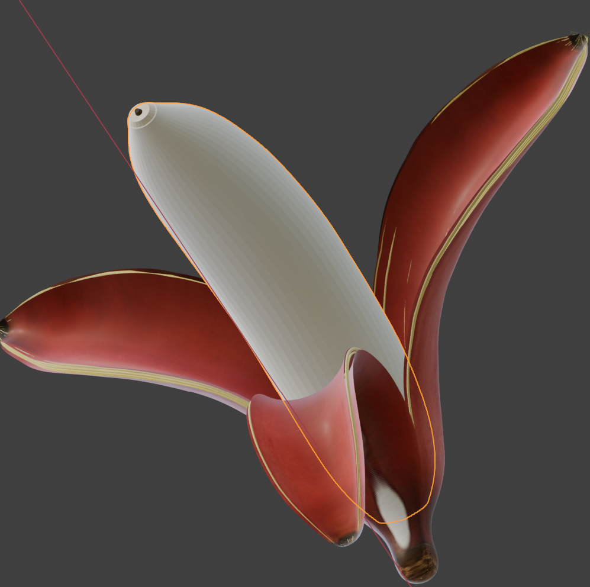
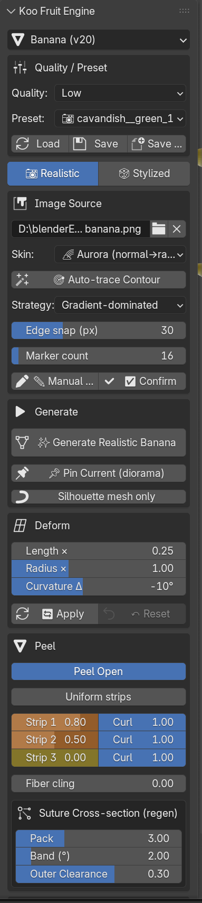
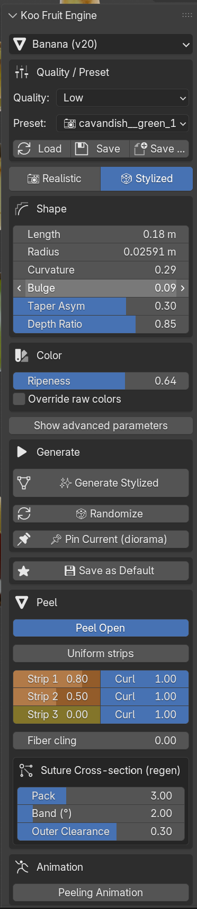
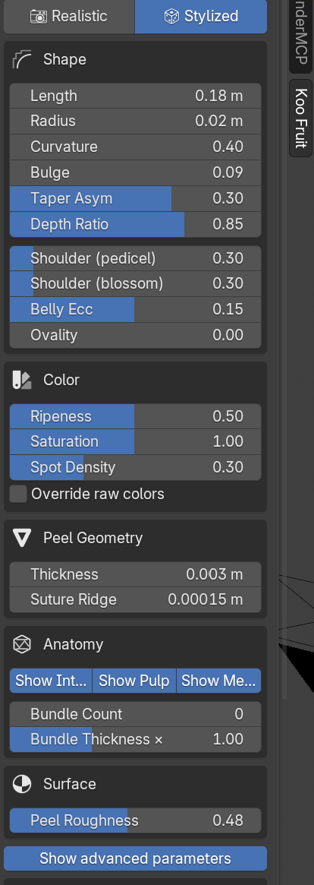
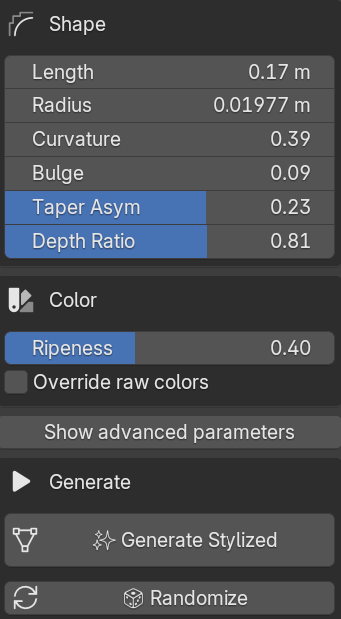

# Koo Fruit Engine — User Manual

> **Version 1.4.0** — Photo → 3D realistic banana with curl animation.
> A Blender 4.2+ extension by kaiser390.

---

## Table of contents

1. [Installation](#1-installation)
2. [Quick start — 60 seconds](#2-quick-start--60-seconds)
3. [Interface overview](#3-interface-overview)
4. [Realistic workflow — from photo](#4-realistic-workflow--from-photo)
5. [Stylized workflow — from sliders](#5-stylized-workflow--from-sliders)
6. [Peeling the banana](#6-peeling-the-banana)
7. [Peel animation](#7-peel-animation)
8. [Deform — reshape an existing banana](#8-deform--reshape-an-existing-banana)
9. [Diorama — multiple bananas in one scene](#9-diorama--multiple-bananas-in-one-scene)
10. [Presets — save and load your bananas](#10-presets--save-and-load-your-bananas)
11. [Tips & troubleshooting](#11-tips--troubleshooting)
12. [Advanced — JSON-editable parameters](#12-advanced--json-editable-parameters)

---

## 1. Installation

1. Download `koo_fruit_engine-1.4.0.zip`.
2. Blender → **Edit → Preferences → Get Extensions** (or **Add-ons** tab).
3. Top-right **↓ Install from Disk**, pick the ZIP.
4. Enable the checkbox next to "Koo Fruit Engine".
5. Open the N-panel in a 3D viewport (press `N`), look for the **Koo Fruit** tab on the right edge.

---

## 2. Quick start — 60 seconds

1. N-panel → **Quality / Preset** → dropdown → pick `★ 🎲 cavendish` → **Load**.
2. Make sure the **Realistic / Stylized** tab is on **🎲 Stylized** (next to the preset dropdown).
3. Scroll down → **Generate** box → click **✨ Generate Stylized**.
4. Numpad `1` to face the banana, `Z` to toggle material preview.

You now have a ripe Cavendish banana. Continue reading for how to feed it a photo, peel it, or animate it.

---

## 3. Interface overview

The entire addon lives in one N-panel section (`N → Koo Fruit`).
Top-to-bottom:

| Block | Purpose |
|------|---------|
| **Fruit Type** | Which fruit recipe to use (Banana now; Apple / Pepper / Flower will auto-register as they're added). |
| **Quality / Preset** | Mesh density (LOW / HIGH) and preset dropdown with Load / Save / Save as… |
| **📷 Realistic \| 🎲 Stylized** | Workflow tabs — switch input mode |
| **Image Source** / **Shape+Color** | Tab-dependent: photo + markers (Realistic) OR slider stack (Stylized) |
| **Generate** | The build button. Plus 📌 Pin and debug helpers. |
| **Deform** *(Realistic only)* | Reshape markers: length × / radius × / curvature Δ |
| **Peel** | Open the peel, slide strip amounts + curl |
| **Animation** | Keyframe the waterfall-close peel animation |

---

## 4. Realistic workflow — from photo

Produce a banana that matches a photograph pixel-for-pixel.

### 4.1 Load the photo

N-panel → **Image Source** → click the **photo path field** → pick your image.
An Image Editor opens automatically with the photo and **48 silhouette markers + 10 control markers** placed in an ellipse around it. For small or simple shapes, drop **Silhouette Markers** down to 12–16 before loading.

### 4.2 Trace the silhouette

Two options — pick whichever snaps to your photo better:

* **🎯 Auto-trace Contour** — detects the fruit edge automatically.
  Works best on clean photos (matte background, decent contrast).
  The **Strategy** dropdown picks the detection algorithm:

  | Strategy | Best for |
  |----------|----------|
  | `ARCHETYPE` | Clean photos — PCA + bin extrema, filters watermarks/shadows |
  | `ARCHETYPE_SNAP` | Default. Archetype + gradient edge snap |
  | `HYBRID` | Saturation mask + edge snap — more detail but noise-prone |
  | `SATURATION` | Fastest, lowest accuracy. Debugging baseline |
  | `GRADIENT_ONLY` | Matte fruit on noisy background — saturation seed + aggressive gradient pull |

  Leave **Edge snap** at 30 px for most photos; raise when the auto-trace starts far from the true edge.

* **✏️ Manual Shape Trace** — modal click-to-aim editor. Left-click a marker to select, click again to move it. `Enter` to exit.
  Use this to nudge markers that auto-trace placed wrong, or to trace from scratch on tricky photos.

### 4.3 Confirm the markers

Once the silhouette matches the banana, click **✅ Confirm**.
The button turns red with `*` whenever markers have moved without a fresh Confirm — that's your "pending" signal.

### 4.4 Pick the skin mode

**Skin** dropdown in the Image Source block:

| Mode | What you get |
|------|--------------|
| `STRIP` | 1D saturation-weighted colour strip wrapped around the banana. Photo-accurate pigment, but photo shadows/highlights are discarded — Blender's own lighting re-shades the mesh. Recommended for stock photos with obvious studio lighting. |
| `FULL` | Planar-XZ UV maps every pixel of the photo onto the mesh. The banana looks **exactly like the photo** from the matching camera angle. Use for 1:1 reproduction; every pixel — including the photo's own lighting — prints onto the surface. |
| `AURORA` | Emission material driven by surface normals. Rainbow gradient — great for "banana lamp" or curvature visualisations. No photo needed. |

### 4.5 Generate

N-panel → **Generate** box → **✨ Generate Realistic Banana**.

Blender thinks for a few seconds (LOW quality: ~4 s, HIGH quality: ~12 s) and your banana appears at the origin. Numpad `1` to align with the photo view.

### 4.6 Iterate

Any time you drag a marker or change the skin mode, click **Generate** again. The addon clears the previous `banana.*` objects and builds fresh.

---

## 5. Stylized workflow — from sliders

No photo, no markers — pure parametric. Use when you want a clean banana of a particular cultivar, variations via randomize, or preset-driven default bananas.

### 5.1 Tab + preset

Switch to the **🎲 Stylized** tab.
**Quality / Preset** dropdown → pick any `🎲` preset (Cavendish, Blue Java, Gros Michel, Lady Finger, Manzano, Plantain, Red Banana, Burro) → **Load**.

### 5.2 Hero sliders (always visible)

Shape: **Length / Radius / Curvature / Bulge / Taper Asym / Depth Ratio**

Color: **Ripeness** (0 green → 0.5 yellow → 1 brown-spotted), **Override raw colors** toggle.

### 5.3 Advanced sliders

Toggle **"Show advanced parameters"** at the bottom of the Stylized tab to reveal:

* Shape: Shoulder sharpness (pedicel / blossom), Belly eccentricity, Ovality
* Color: Saturation scale, Spot density
* Peel Geometry: Thickness, Suture Ridge
* Anatomy: Show Interior / Pulp / Membrane toggles, Bundle Count, Bundle Thickness ×
* Surface: Peel Roughness

Everything else in the JSON schema (~40 more parameters — tube radii, honey bezier controls, per-primitive roughness, SSS settings) stays file-editable. See [§12 Advanced — JSON-editable parameters](#12-advanced--json-editable-parameters).

### 5.4 Generate + Randomize

**✨ Generate Stylized** — builds the banana from current sliders.
**🎲 Randomize** — rolls the hero sliders to plausible-banana values. Doesn't auto-generate — inspect first, then Generate.

---

## 6. Peeling the banana

The **Peel** block appears after Generate. Works in both tabs.

### 6.1 Basic — Peel Open

Toggle **Peel Open** to enable peel interaction. Three strip sliders appear:

| Slider | What it does |
|-------|-------------|
| Strip 1 / 2 / 3 Amount | How far each of the three peel strips is pulled back (0 = closed, 1 = fully peeled to the stem anchor) |
| Curl | Per-strip curl amount — controls how tightly the peeled strip rolls up |
| Fiber cling | 0 = fibers curl with the peel; 1 = fibers stay on the flesh |

### 6.2 Uniform mode

Turn on **Uniform strips** to drive all three strips with one Amount + Curl pair. Fast way to open the whole peel symmetrically.

### 6.3 Suture cross-section

Only shows when the peel is open. Three knobs control the bundle pack that shows at the torn edge:

* **Pack** (0–10): how many extra bundles go near each suture line. 0.3 default; 10 gives 11× the body bundle count clustered at the sutures.
* **Band (°)**: angular half-width of the Gaussian cluster around each suture.
* **Outer Clearance**: fraction of the peel-layer span reserved near the epidermis — keeps bundles from shadowing through the outer shell.

---

## 7. Peel animation

### 7.1 Enable

**Animation** block → toggle **Peeling Animation**.

Keyframes install immediately on the three strip-amount sliders and the timeline jumps to `[1 .. F_end]`.

### 7.2 Scenario

The built-in scenario is a cascade open + simultaneous close:

1. Strip 1 opens alone, hitting 50 % at one phase_duration.
2. At that moment Strip 2 starts; it hits 50 % one phase later.
3. At *that* moment Strip 3 starts; it hits 50 % another phase later.
4. All three reverse — reach 0 at the same final frame.

Default `phase = 20`, `close = 20` → total 80 frames. Adjust the two sliders and the keyframes re-install automatically.

Press `Spacebar` in the 3D viewport or the Timeline's ▶ Play to watch.

### 7.3 Disable

Turn the toggle off to remove the keyframes — sliders become static again.

---

## 8. Deform — reshape an existing banana

Only in the **Realistic** tab, since it transforms markers. The sliders apply to the markers and rebuild the silhouette — so the photo UV re-projects onto the new outline, no stretch artefact.

### 8.1 Sliders

| Slider | Meaning |
|-------|---------|
| Length × | Scale along the stem→stigma axis (0.5–2.0 soft range) |
| Radius × | Scale perpendicular to the axis (same range) |
| Curvature Δ | Additional bend on top of the photo's natural curvature |

All three are **relative to the original markers** captured on the first Apply — sliders at `1 / 1 / 0` = no change.

### 8.2 Apply

**🔄 Apply** transforms markers and rebuilds. Baseline is captured automatically on the first Apply.

**↶ Reset** restores the original markers and resets the sliders.

---

## 9. Diorama — multiple bananas in one scene

The addon builds one **active** banana at a time (each Generate clears the previous `banana.*` objects). To keep multiple bananas in the scene side-by-side — for a variety pack render, say — use **📌 Pin Current**.

### 9.1 Workflow

1. Generate banana #1 (any tab).
2. **📌 Pin Current (diorama)** in the Generate box.
   * Every `banana.*` object is renamed to `banana_pinned_1.*`, moved into a new `Banana_Pinned_1` collection, and translated aside along +X.
3. Change preset / sliders / photo / whatever.
4. Generate banana #2 → appears at origin, pinned_1 still visible.
5. **📌 Pin Current** again → pinned_2 lands next to pinned_1.
6. Rinse + repeat. Frame + render.

### 9.2 Caveats

* Pinned bananas are **frozen** — peel curl, deform and animation only affect the active (non-pinned) banana.
* If you want to edit a pinned banana later, Outliner → rename its prefix back to `banana.`. But the next Generate will clear it, so save a preset first.

---

## 10. Presets — save and load your bananas

**Quality / Preset** block at the top of the panel. Every preset is a JSON file that captures the full parameter state + (for realistic presets) the markers and photo path.

### 10.1 Dropdown icons

| Prefix | Meaning |
|--------|---------|
| `★` | Built-in preset (locked, can't overwrite — fork via Save as…) |
| `🎲` | Parametric preset (Stylized-friendly) |
| `📷` | Has markers + photo block (Realistic-friendly) |

Built-in examples: `★ 🎲 cavendish`, `★ 📷 realistic_red_banana`.

### 10.2 Buttons

| Button | Action |
|--------|--------|
| **Load** | Apply the selected preset to the scene |
| **Save** | Overwrite the currently selected user preset (disabled for built-ins) |
| **Save as…** | Write to a new name |

### 10.3 Save as Default *(Stylized tab only)*

Found at the bottom of the Stylized tab. Writes the current state to the well-known `user_default` preset slot. Reload any time via the dropdown to return to your personal default banana.

---

## 11. Tips & troubleshooting

### The peel / pulp pokes out of the silhouette
On highly-curved bananas this can happen at the narrow stem neck. Workaround: in the Realistic tab, drag the **Neck** markers slightly into the body (toward the thick midpoint). That shrinks the pulp's axial range so it stays clear of the narrow region.

### Photo looks tiled or smeared on the back of the peel
The planar-XZ UV is mirror-symmetric about the Y axis by design — the back gets the mirrored photo. From the camera angle that shot the original photo, this is invisible. If you render from the opposite side, expect mirrored pigment.

### Markers auto-place back to the default ellipse when I load a preset
Fixed in v1.3. If you still see it, make sure the preset was saved in v1.3+ (it'll have `markers_version` in its JSON).

### Generate is slow
Drop **Quality** from `HIGH` to `LOW` — still production-grade mesh density (48 × 60 rings, 60 bundles).

### I want to change a parameter that's not in the N-panel
See [§12 Advanced — JSON-editable parameters](#12-advanced--json-editable-parameters).

### Addon didn't install / can't find Koo Fruit tab
Blender 4.2+ is required. For 4.2 LTS you may need to enable "Extensions" in Preferences first.

---

## 12. Advanced — JSON-editable parameters

The N-panel exposes ~22 curated hero parameters. The JSON preset schema defines ~60+ more. To edit them:

* **User preset**: edit `%APPDATA%/Blender Foundation/Blender/5.0/config/fruit_engine/presets/<name>.json`, then `Load` from the dropdown.
* **Built-in**: fork via Save as… first; the built-ins stay read-only.

Full UI-vs-JSON mapping table:
[`docs/stylized_params_advanced.md`](stylized_params_advanced.md)

Each preset value corresponds to a registered parameter in
`addon/koo_fruit_engine/data/parameters/banana.json`
— same schema for every fruit archetype.

---

## License & credits

GPL-3.0-or-later — © 2026 kaiser390 (kaiser390@naver.com)

Built on Blender's extensions system (4.2+). Uses numpy only — no
other runtime dependencies.

Feedback, bug reports and preset contributions welcome at the
project's repository.
